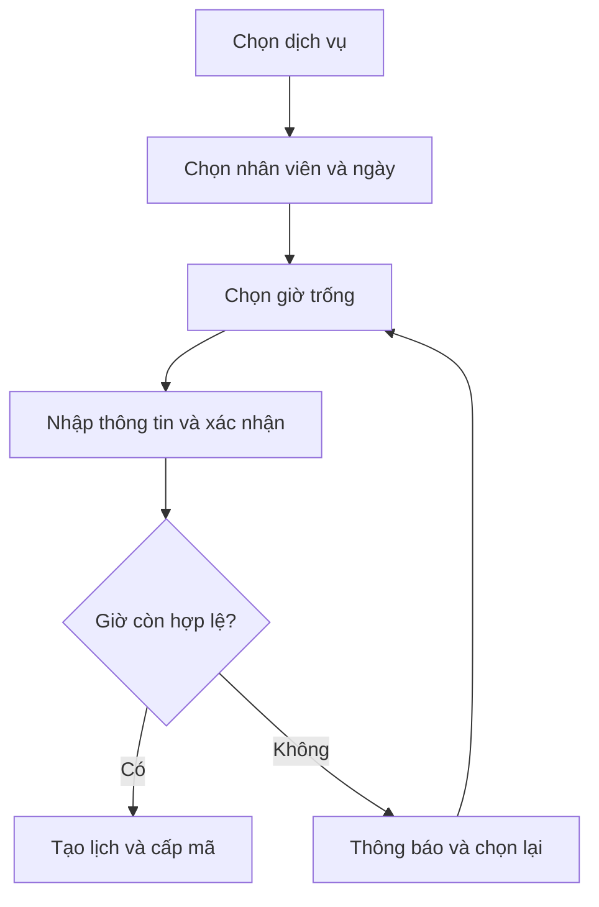

# TÀI LIỆU YÊU CẦU SẢN PHẨM (PRD)

# SpaFlow — Hệ thống đặt lịch và quản lý vận hành spa

| Thông tin | Nội dung |
| --- | --- |
| Phiên bản | 1.0 — bản chuẩn hóa từ PRD gốc |
| Trạng thái | Dự thảo, chờ xác nhận các quyết định nghiệp vụ |
| Ngày | 23/09/2026 |
| Mục đích | Định hướng thiết kế, phát triển và nghiệm thu MVP cho cuộc thi Vibe Coding |
| Nguồn | PRD SpaFlow do người dùng cung cấp |
| Người phê duyệt | **[CẦN XÁC NHẬN]** Product Owner và đại diện spa |

> **Quy ước:** **[CẦN XÁC NHẬN]** là thông tin chưa được tài liệu gốc quyết định. **[ĐỀ XUẤT]** là cách làm rõ để đội dự án xem xét; không mặc nhiên là phạm vi đã phê duyệt. Phạm vi Must/Should/Could giữ theo tài liệu gốc, trừ khi có quyết định thay đổi được ghi lại.

## 1. Tóm tắt điều hành

SpaFlow là hệ thống cho phép khách hàng tự đặt lịch theo dịch vụ, nhân viên và thời gian còn trống. Spa dùng một lịch tập trung để quản lý lịch hẹn, lịch làm việc, khách hàng và tiến trình phục vụ. MVP tập trung vào ba kết quả: **khách đặt lịch thuận tiện; nhân viên không bị đặt trùng; lễ tân và quản lý theo dõi được hoạt động trong ngày**.

Sản phẩm hướng đến spa nhỏ và vừa. Phạm vi MVP giả định **một chi nhánh; mỗi lịch hẹn gồm một dịch vụ chính và một nhân viên chính**. Tính năng AI, thanh toán và quản trị nhiều chi nhánh không phải điều kiện của luồng đặt lịch cốt lõi.

## 2. Bối cảnh, bài toán và cơ hội

### 2.1. Hiện trạng

Theo tài liệu gốc, spa có thể nhận yêu cầu qua Facebook, Zalo, điện thoại, khách đến trực tiếp, sổ tay hoặc bảng tính. Lễ tân phải đối chiếu lịch thủ công, làm tăng nguy cơ bỏ sót yêu cầu, nhầm nhân viên hoặc trùng giờ. Khách phải chờ xác nhận và có thể quên lịch; quản lý thiếu góc nhìn tập trung về lịch, hủy và vắng mặt.

Đây là mô tả vấn đề để định hướng sản phẩm. **Chưa có số liệu khảo sát, baseline hoặc spa thí điểm cụ thể**; các tác động kinh doanh phải được kiểm chứng sau khi triển khai.

### 2.2. Tuyên bố vấn đề

> Khách hàng cần biết chính xác khung giờ phù hợp để đặt lịch nhanh; spa cần nhận và xử lý lịch trên một hệ thống thống nhất, tránh đặt hai khách vào cùng khoảng phục vụ của một nhân viên.

### 2.3. Giá trị dự kiến

- Khách xem lựa chọn khả dụng và hoàn tất đặt lịch không phụ thuộc phản hồi thủ công của lễ tân.
- Lễ tân có lịch tập trung để tạo, xác nhận và theo dõi lịch.
- Nhân viên biết lịch được giao và cập nhật tiến trình dịch vụ.
- Quản lý xem lịch, lịch sử khách và số liệu vận hành cơ bản.

## 3. Mục tiêu sản phẩm và thước đo

| Mã | Mục tiêu | Chỉ số và cách đo | Mức mục tiêu | Trạng thái |
| --- | --- | --- | --- | --- |
| G-01 | Tăng khả năng hoàn tất đặt lịch | Số phiên đặt thành công / số phiên bắt đầu đặt | **[CẦN XÁC NHẬN]** ngưỡng và baseline | Chỉ số có trong tài liệu gốc |
| G-02 | Giảm thời gian đặt lịch | Từ bắt đầu chọn dịch vụ đến khi hiển thị trang thành công | ≤ 3 phút cho kịch bản chuẩn | Mục tiêu đề xuất trong tài liệu gốc; điều kiện đo **[CẦN XÁC NHẬN]** |
| G-03 | Tránh trùng lịch nhân viên | Số cặp lịch cùng nhân viên có khoảng thời gian giao nhau trái quy tắc | 0 | Điều kiện chất lượng bắt buộc |
| G-04 | Giảm tỷ lệ no-show | Số lịch no-show / số lịch đến hạn phục vụ | **[CẦN XÁC NHẬN]** baseline, ngưỡng và kỳ đo | Mục tiêu kinh doanh, chưa chứng minh |
| G-05 | Giảm thao tác thủ công của lễ tân | Thời gian xử lý một lịch và số lần đối chiếu thủ công | **[CẦN XÁC NHẬN]** cách đo và ngưỡng | Mục tiêu kinh doanh |
| G-06 | Trải nghiệm nhanh | Số bước chính; thời gian phản hồi của thao tác thông thường | Mục tiêu ≤ 5 bước và khoảng 2 giây | Cần thống nhất điều kiện đo |

**[ĐỀ XUẤT]** Nếu cần chứng minh G-01/G-04, ghi nhận sự kiện bắt đầu đặt, chọn slot, đặt thành công/thất bại và trạng thái no-show. **[CẦN XÁC NHẬN]** Có đo bằng sự kiện thật trong MVP hay thống kê thủ công trên dữ liệu demo.

## 4. Người dùng mục tiêu và nhu cầu

| Nhóm | Nhu cầu | Tác vụ chính |
| --- | --- | --- |
| Khách hàng | Đặt được giờ phù hợp, biết dịch vụ và nhân viên, nhận thông tin lịch rõ ràng | Xem dịch vụ, giờ trống, đặt lịch |
| Lễ tân | Kiểm soát lịch trên một màn hình, xử lý khách đến và ngoại lệ | Tạo lịch thay khách, xác nhận, check-in, hủy, ghi nhận no-show |
| Nhân viên spa | Biết lịch làm việc và dịch vụ cần thực hiện | Xem lịch cá nhân, bắt đầu và hoàn tất dịch vụ |
| Quản lý/Admin | Kiểm soát nguồn lực và vận hành | Quản lý dịch vụ/nhân viên/giờ làm, xem lịch và dashboard |

Phân khúc mục tiêu từ tài liệu gốc: spa nhỏ khoảng 3–10 nhân viên và spa vừa khoảng 10–30 nhân viên. Chuỗi spa là hướng mở rộng sau MVP. Tên và hoàn cảnh các persona trong bản gốc chỉ là ví dụ minh họa, chưa phải kết quả nghiên cứu người dùng.

## 5. Phạm vi sản phẩm

### 5.1. Phạm vi MVP bắt buộc (Must Have)

1. Quản lý danh mục dịch vụ và nhân viên có thể thực hiện từng dịch vụ.
2. Thiết lập lịch làm việc, giờ nghỉ và nghỉ phép của nhân viên.
3. Khách và lễ tân tạo lịch từ các khung giờ hợp lệ.
4. Tính giờ trống theo thời lượng dịch vụ, lịch làm và lịch đã có; ngăn đặt trùng.
5. Theo dõi và cập nhật trạng thái lịch hẹn.
6. Xem lịch ngày/tuần/tháng; quản lý hồ sơ và lịch sử khách hàng.
7. Dashboard số liệu lịch cơ bản.

### 5.2. Phạm vi ưu tiên tiếp theo

| Mức | Nhóm tính năng | Điều kiện đưa vào bản thi |
| --- | --- | --- |
| Should | Gợi ý giờ gần nhất hoặc nhân viên khác khi slot không khả dụng | **[CẦN XÁC NHẬN]** Có nâng thành điều kiện bắt buộc demo không |
| Should | Nhắc lịch 24 giờ/2 giờ; khách xác nhận/đổi/hủy; mục “Cần xử lý” | Cần chốt kênh và chính sách vận hành |
| Could | Đặt lịch bằng ngôn ngữ tự nhiên, AI gợi ý dịch vụ, đánh giá, nhãn khách | Chỉ thực hiện sau khi luồng cốt lõi ổn định |

**Mâu thuẫn cần quyết định:** Bản gốc xếp “gợi ý slot” là Should nhưng đưa vào tiêu chí nghiệm thu và Definition of Done. PRD này giữ Should. Nếu hội đồng/đội thi yêu cầu thể hiện tính năng này trong demo, Product Owner cần đổi ưu tiên thành Must và cập nhật điều kiện nghiệm thu tương ứng.

### 5.3. Ngoài phạm vi MVP

POS, thanh toán online, payroll, quản lý kho và mỹ phẩm, membership, loyalty phức tạp, marketing automation, quản lý nhiều chi nhánh nâng cao và ứng dụng di động native. Công nghệ triển khai cụ thể cũng không phải quyết định của PRD này.

### 5.4. Giả định và ràng buộc

- Một chi nhánh, một dịch vụ chính và một nhân viên chính cho mỗi lịch; thời lượng dịch vụ được cấu hình cố định trong danh mục.
- Khách cung cấp số điện thoại để nhận diện; cách xác minh chủ sở hữu lịch **[CẦN XÁC NHẬN]**.
- Thời gian xây dựng MVP bị giới hạn bởi cuộc thi; mốc thời gian, nhân lực và hệ thống triển khai **[CẦN XÁC NHẬN]**.
- AI và kênh gửi thông báo có thể là phụ thuộc bên ngoài; không để chúng chặn luồng đặt lịch thủ công.

## 6. Luồng người dùng

### 6.1. Khách đặt lịch

1. Vào trang đặt lịch và chọn dịch vụ đang hoạt động.
2. Chọn nhân viên đủ khả năng thực hiện hoặc “Bất kỳ nhân viên nào”.
3. Chọn ngày; xem các khung giờ trống theo thời lượng dịch vụ và lịch làm.
4. Chọn giờ; nhập tên, số điện thoại và các thông tin bổ sung.
5. Xem lại dịch vụ, nhân viên, giờ, giá; xác nhận yêu cầu.
6. Máy chủ kiểm tra lại khung giờ trước khi tạo. Nếu hợp lệ, tạo một lịch và trả mã đặt lịch; nếu giờ vừa bị chiếm, báo hết chỗ và cho chọn lại.

**[CẦN XÁC NHẬN]** Trường nào bắt buộc ngoài tên/số điện thoại; sau khi tạo lịch chuyển sang Pending hay Confirmed; khách xem lại lịch bằng cơ chế nào.

### 6.2. Lễ tân tạo và xử lý lịch

Lễ tân tìm/chọn khách, dịch vụ, nhân viên và giờ; hệ thống áp dụng cùng quy tắc khả dụng như đặt lịch trực tuyến. Tùy trạng thái ban đầu đã chốt, lễ tân xác nhận lịch, check-in khi khách đến, hủy hoặc đánh dấu no-show. Các thay đổi phải được cập nhật trên Calendar, danh sách lịch, dashboard và lịch sử khách.

### 6.3. Nhân viên thực hiện dịch vụ

Nhân viên xem các lịch được giao. Sau check-in, nhân viên bắt đầu dịch vụ (`In Service`) và đánh dấu hoàn tất (`Completed`). **[CẦN XÁC NHẬN]** Lễ tân/quản lý có được thao tác thay nhân viên không.

### 6.4. Luồng ngoại lệ và mở rộng

- Slot vừa bị khách khác đặt: không tạo lịch trùng; trả thông báo rõ ràng. Nếu tính năng Should được triển khai, gợi ý giờ hoặc nhân viên khác thực sự hợp lệ.
- Khách hủy/đổi lịch: là Should, chỉ mở khi có cách xác minh khách và chính sách thời hạn **[CẦN XÁC NHẬN]**.
- Nhắc lịch thất bại: **[ĐỀ XUẤT]** không thay đổi trạng thái lịch; ghi lỗi gửi và hỗ trợ xử lý lại.
- AI hiểu yêu cầu mơ hồ: nếu làm Could Have, hiển thị nội dung đã phân tích để khách xác nhận trước khi tìm và đặt slot.

## 7. Yêu cầu chức năng chi tiết

| ID | Ưu tiên | Yêu cầu có thể kiểm thử |
| --- | --- | --- |
| FR-01 | Must | Quản lý tạo, sửa, bật/tắt dịch vụ với tên, giá, thời lượng, mô tả, hình ảnh, danh mục. Dịch vụ tắt không được chọn khi đặt lịch mới. |
| FR-02 | Must | Quản lý thông tin nhân viên, trạng thái và tập dịch vụ nhân viên có thể thực hiện. |
| FR-03 | Must | Cấu hình ngày/giờ làm, break và nghỉ phép cho nhân viên; giờ trống phản ánh lịch này. |
| FR-04 | Must | Khách đặt lịch theo dịch vụ, nhân viên hoặc “bất kỳ”, ngày/giờ; lễ tân tạo lịch thay khách. Lịch thành công có mã riêng. |
| FR-05 | Must | Hệ thống tính slot đủ thời lượng và không chồng lịch nhân viên; kiểm tra lại và từ chối xung đột ở thời điểm tạo/đổi. |
| FR-06 | Must | Quản lý các trạng thái Pending, Confirmed, Checked-in, In Service, Completed, Cancelled và No-show. |
| FR-07 | Must | Xem Calendar ngày/tuần/tháng, danh sách và chi tiết lịch. **[CẦN XÁC NHẬN]** Bộ lọc bắt buộc. |
| FR-08 | Must | Lưu hồ sơ khách và lịch sử Completed, Cancelled, No-show, các lịch liên quan. |
| FR-09 | Must | Dashboard hiển thị tổng lịch hôm nay, Confirmed, Completed, Cancelled, No-show và lịch sắp tới. Quy tắc đếm **[CẦN XÁC NHẬN]**. |
| FR-10 | Should | Nếu slot không có, gợi ý giờ gần nhất hoặc nhân viên khác có thể phục vụ. Không hiển thị gợi ý không hợp lệ. |
| FR-11 | Should | Nhắc trước lịch 24 giờ và 2 giờ qua kênh **[CẦN XÁC NHẬN]**; phân biệt gửi thật và mô phỏng. |
| FR-12 | Should | Khách xác nhận/đổi/hủy lịch; hiển thị lịch chưa xác nhận, khách sắp đến, lịch thay đổi và no-show trong mục cần xử lý. Chi tiết chính sách **[CẦN XÁC NHẬN]**. |
| FR-13 | Could | Nhập câu tự nhiên và xác nhận thông tin đã hiểu; gợi ý dịch vụ, đánh giá và nhãn khách được đặc tả riêng nếu chọn triển khai. |

### 7.1. Ma trận quyền nghiệp vụ

| Tác vụ | Khách | Lễ tân | Nhân viên | Quản lý |
| --- | --- | --- | --- | --- |
| Xem dịch vụ, giờ trống; tự đặt lịch | Có | Có | **[CẦN XÁC NHẬN]** | **[CẦN XÁC NHẬN]** |
| Xem lịch toàn spa, tạo lịch thay khách | Không | Có | Không theo nhu cầu gốc | Có **[ĐỀ XUẤT]** |
| Xem lịch cá nhân, bắt đầu/hoàn tất dịch vụ | Không | **[CẦN XÁC NHẬN]** | Có | **[CẦN XÁC NHẬN]** |
| Xác nhận, check-in, hủy, ghi no-show | Hủy/xác nhận thuộc Should | Có | **[CẦN XÁC NHẬN]** | **[CẦN XÁC NHẬN]** |
| Quản lý dịch vụ, nhân viên và lịch làm | Không | **[CẦN XÁC NHẬN]** | Không theo nhu cầu gốc | Có |

Tài liệu gốc không đủ chi tiết để coi toàn bộ bảng trên là quy tắc phân quyền đã duyệt. Những ô chưa rõ phải được chốt trước khi phát triển thao tác tương ứng.

## 8. Quy tắc nghiệp vụ

| ID | Quy tắc |
| --- | --- |
| BR-01 | Nhân viên được gán phải có khả năng thực hiện dịch vụ. |
| BR-02 | Khoảng phục vụ phải nằm trong giờ làm và không đi qua thời gian nghỉ/ngày nghỉ. |
| BR-03 | `endTime = startTime + serviceDuration`. |
| BR-04 | Hai lịch cùng nhân viên giao nhau khi `newStart < existingEnd` và `newEnd > existingStart`; lịch giao nhau không được tạo. |
| BR-05 | Lịch Cancelled không chiếm slot; Completed không được sửa thời gian; No-show phải có trong lịch sử khách. |
| BR-06 | Khi hiển thị giờ trống, chỉ đưa ra nhân viên phù hợp; khi lưu lịch, kiểm tra lại khả dụng. |
| BR-07 | **[CẦN XÁC NHẬN]** Pending có chiếm chỗ không, trạng thái ban đầu là gì và trạng thái nào cho phép đổi/hủy. |
| BR-08 | **[CẦN XÁC NHẬN]** Bước chia slot, hạn đặt trước, buffer, phòng/giường, điều kiện no-show, khách muộn và múi giờ. |
| BR-09 | **[CẦN XÁC NHẬN]** Lịch hiện hữu được xử lý ra sao khi sửa dịch vụ, giá/thời lượng, nhân viên hoặc lịch làm. |
| BR-10 | **[ĐỀ XUẤT]** Lưu giá và thời lượng tại thời điểm đặt để chỉnh danh mục sau này không tự thay đổi lịch cũ. |
| BR-11 | **[ĐỀ XUẤT]** Hai yêu cầu đồng thời đặt cùng khoảng chỉ được phép tạo tối đa một lịch; kiểm tra phải có hiệu lực khi ghi dữ liệu. |

### 8.1. Vòng đời lịch hẹn

| Từ | Sự kiện | Sang | Điều kiện |
| --- | --- | --- | --- |
| Pending | Xác nhận | Confirmed | **[CẦN XÁC NHẬN]** ai xác nhận |
| Confirmed | Check-in | Checked-in | Khách đến spa |
| Checked-in | Bắt đầu | In Service | Nhân viên bắt đầu phục vụ |
| In Service | Hoàn tất | Completed | Dịch vụ kết thúc |
| Pending/Confirmed | Hủy | Cancelled | **[CẦN XÁC NHẬN]** người và thời hạn |
| Confirmed | Đánh dấu vắng mặt | No-show | **[CẦN XÁC NHẬN]** thời điểm đủ điều kiện |

**[CẦN XÁC NHẬN]** Có tự động xác nhận ngay khi đặt hay phải qua Pending; có cho phép hủy sau check-in, hoàn tác và xử lý sai thao tác hay không. Không tự suy diễn các chuyển trạng thái không xuất hiện trong bảng.

## 9. Dữ liệu và tích hợp

### 9.1. Thực thể nghiệp vụ

| Thực thể | Thuộc tính cốt lõi | Quan hệ/vấn đề cần làm rõ |
| --- | --- | --- |
| Customer | ID, tên, số điện thoại, email, ghi chú, ngày tạo | Một khách có nhiều lịch; quy tắc khách trùng **[CẦN XÁC NHẬN]** |
| Staff | ID, tên, điện thoại, email, avatar, trạng thái | Có nhiều dịch vụ, nhiều ca làm và nhiều lịch |
| Service | ID, tên, mô tả, thời lượng, giá, danh mục, hình ảnh, trạng thái | Có thể do nhiều nhân viên thực hiện |
| StaffService | Nhân viên, dịch vụ | Liên kết năng lực thực hiện |
| StaffSchedule | Nhân viên, ngày/giờ làm, break, nghỉ phép | Quy tắc ngày lặp và ngoại lệ **[CẦN XÁC NHẬN]** |
| Appointment | ID, mã đặt, khách, nhân viên, dịch vụ, ngày/giờ bắt đầu/kết thúc, trạng thái, ghi chú, ngày tạo/cập nhật | Mỗi lịch có một khách, một nhân viên chính, một dịch vụ chính |
| User | ID, vai trò và thông tin đăng nhập | Cơ chế xác thực **[CẦN XÁC NHẬN]** |
| Notification | Lịch liên quan, loại và trạng thái gửi **[ĐỀ XUẤT]** | Chỉ cần nếu triển khai nhắc lịch |

**[ĐỀ XUẤT]** Ghi nhật ký thay đổi quan trọng của lịch (người thao tác, thời điểm, trạng thái trước/sau) để đáp ứng yêu cầu truy vết. **[CẦN XÁC NHẬN]** Múi giờ lưu trữ, thời gian giữ dữ liệu và chính sách truy cập thông tin khách. Bảng trên là mô hình logic; schema cụ thể do thiết kế kỹ thuật quyết định.

### 9.2. Tích hợp bên ngoài

- Email/SMS: chỉ cần khi thực hiện FR-11; kênh và nhà cung cấp **[CẦN XÁC NHẬN]**.
- AI/LLM: chỉ cần khi thực hiện phần Could của FR-13.
- Database và hosting: cần cho MVP chạy thực tế; tài liệu gốc nêu PostgreSQL, React/Next.js, Node/NestJS/Supabase như gợi ý công nghệ, không chốt nền tảng.
- Nếu bản thi mô phỏng thông báo, giao diện và phần trình bày phải ghi đúng là mô phỏng, không coi là đã gửi tới khách.

## 10. Danh sách màn hình và định hướng UX

| Khu vực | Màn hình tối thiểu | Nội dung chính |
| --- | --- | --- |
| Khách | Trang đặt lịch, dịch vụ, nhân viên, ngày/giờ, thông tin, xác nhận, thành công | Tên, giá, thời lượng, nhân viên, giờ trống, thông tin liên hệ, mã đặt |
| Lễ tân/quản lý | Dashboard, Calendar, danh sách/chi tiết lịch, danh sách/chi tiết khách | Lịch hôm nay, lịch sắp tới, hành động theo quyền và lịch sử |
| Quản lý | Dịch vụ, nhân viên, lịch làm | Thêm/sửa/bật tắt và thiết lập nguồn lực |
| Nhân viên | Lịch được giao và chi tiết công việc | Xem lịch, bắt đầu/hoàn tất; bố trí giao diện **[CẦN XÁC NHẬN]** |

Giao diện đặt lịch ưu tiên mobile và hỗ trợ tablet/desktop. Cần thiết kế trạng thái tải, trống, lỗi, slot vừa hết và thành công. **[CẦN XÁC NHẬN]** Có mockup/prototype chính thức hay không; tài liệu gốc chỉ liệt kê màn hình, chưa kèm bản thiết kế.

## 11. Yêu cầu phi chức năng

| ID | Nhóm | Yêu cầu | Điều kiện cần chốt |
| --- | --- | --- | --- |
| NFR-01 | Hiệu năng | Trang chính mục tiêu tải ≤ 2 giây; thao tác thường < 2 giây với khối lượng dữ liệu MVP | Thiết bị, mạng, dữ liệu, cách và kỳ đo |
| NFR-02 | Toàn vẹn | Không tạo hai lịch hoạt động giao nhau cho cùng nhân viên | Tập trạng thái chiếm slot; kiểm thử đồng thời |
| NFR-03 | Bảo mật | Xác thực, phân quyền, kiểm tra đầu vào, không truy cập dữ liệu ngoài quyền | Cơ chế xác thực nội bộ và khách |
| NFR-04 | Responsive | Đặt lịch ưu tiên mobile; các màn hình hoạt động trên tablet/desktop | Trình duyệt và kích thước màn hình |
| NFR-05 | Audit | Có khả năng truy vết tạo, đổi, hủy, check-in và hoàn thành | Độ chi tiết và thời gian giữ log |
| NFR-06 | Mở rộng | Không giả định chỉ một nhân viên/dịch vụ; thiết kế có thể mở rộng nhiều chi nhánh về sau | Không triển khai đa chi nhánh trong MVP |
| NFR-07 | Độ tin cậy **[ĐỀ XUẤT]** | Lỗi gửi thông báo không được làm mất lịch đã tạo; lỗi lưu phải báo rõ | Cách phục hồi và retry |

**[CẦN XÁC NHẬN]** Chính sách riêng tư, sao lưu/khôi phục và chỉ tiêu sẵn sàng nếu chuyển từ demo sang sử dụng với khách thật. Không gán ngưỡng khi chưa có yêu cầu từ đơn vị vận hành.

## 12. Tiêu chí nghiệm thu

### 12.1. Điều kiện bắt buộc của MVP

| ID | Tình huống | Kết quả đạt |
| --- | --- | --- |
| AC-01 | Quản lý cấu hình dịch vụ, nhân viên, năng lực và ca làm/nghỉ | Thông tin được lưu và phản ánh khi tìm lịch trống |
| AC-02 | Khách chọn dịch vụ, nhân viên hoặc “bất kỳ”, giờ trống và gửi thông tin hợp lệ | Có đúng một lịch, mã đặt và trang thành công; trạng thái theo BR-07 đã chốt |
| AC-03 | Slot vượt ca làm, đè break/nghỉ hoặc chồng lịch | Không được đặt; khách nhận thông báo rõ ràng |
| AC-04 | Hai khách gửi yêu cầu gần như đồng thời cho cùng nhân viên và khoảng giao nhau | Tối đa một yêu cầu thành công, không double-booking |
| AC-05 | Lễ tân tạo lịch, xác nhận, check-in, ghi hủy/no-show theo quy tắc; nhân viên bắt đầu/hoàn tất | Trạng thái, Calendar, hồ sơ khách và dashboard cập nhật phù hợp |
| AC-06 | Xem Calendar ngày/tuần/tháng và chi tiết lịch | Đúng thời gian, nhân viên, dịch vụ và trạng thái |
| AC-07 | Xem dashboard sau khi tạo/đổi trạng thái | Các chỉ số khớp định nghĩa và dữ liệu lịch trong ngày |
| AC-08 | Truy cập dữ liệu/hành động ngoài quyền | Bị từ chối; không thay đổi dữ liệu |
| AC-09 | Sửa thời gian lịch đã Completed; xem lịch đã Cancelled/No-show | Không sửa được thời gian Completed; lịch hủy/no-show có trong lịch sử theo quy tắc |

### 12.2. Chỉ nghiệm thu nếu tính năng Should/Could được chọn

| ID | Tính năng | Kết quả đạt |
| --- | --- | --- |
| AC-S01 | Gợi ý thay thế | Khi hết slot và tồn tại phương án phù hợp, các gợi ý đáp ứng lịch làm và năng lực nhân viên |
| AC-S02 | Nhắc lịch | Đến mốc 24 giờ/2 giờ, kênh đã chốt gửi hoặc ghi log mô phỏng chính xác |
| AC-S03 | Khách đổi/hủy | Xác minh chủ lịch và áp dụng đúng chính sách thời hạn, cập nhật slot và lịch sử |
| AC-C01 | Câu tự nhiên | Hiển thị nội dung đã hiểu; khách có thể sửa/xác nhận trước khi đặt |

### 12.3. Definition of Done cho bản demo

Có dữ liệu mẫu tối thiểu **5 dịch vụ, 4 nhân viên**, lịch làm, luồng khách đặt lịch, chống trùng, Calendar, Dashboard, lịch sử khách, vòng đời lịch và giao diện responsive. Demo có thể chạy từ đầu đến cuối mà không sửa dữ liệu thủ công. **Gợi ý thay thế** có mặt trong DoD gốc nhưng mức ưu tiên vẫn là Should; việc có xem đây là điều kiện bắt buộc phải được chốt ở mục 14.

## 13. Rủi ro và phụ thuộc

| Rủi ro/phụ thuộc | Hậu quả | Hướng xử lý |
| --- | --- | --- |
| Hai yêu cầu đặt cùng lúc | Trùng lịch | Kiểm tra tại lúc ghi và kiểm thử cạnh tranh |
| Logic chỉ so giờ bắt đầu, bỏ qua thời lượng | Giao nhau không được phát hiện | Kiểm tra hai đầu khoảng thời gian |
| Phạm vi tăng sang CRM/POS/loyalty | Trễ MVP | Quản lý yêu cầu mới theo MoSCoW |
| Email/SMS không khả dụng | Không nhắc được khách | Quyết định kênh; cho demo mô phỏng có nhãn nếu phù hợp |
| AI hiểu sai yêu cầu | Đặt sai dịch vụ/giờ | Cho khách kiểm tra trước khi xác nhận; AI không chặn luồng thủ công |
| Chính sách spa chưa chốt | Dev và QA hiểu khác nhau | Giải quyết mục 14 trước khi xây và nghiệm thu luồng tương ứng |

## 14. Câu hỏi cần xác nhận và quyết định sản phẩm

| Mã | Ưu tiên | Quyết định cần chốt | Bên chốt đề xuất |
| --- | --- | --- | --- |
| Q-01 | P0 | Lịch mới là Pending hay Confirmed? Pending có chiếm slot không? | Product Owner/đại diện spa |
| Q-02 | P0 | Ai được xác nhận, check-in, hủy, đánh dấu no-show, bắt đầu/hoàn tất; thời điểm no-show? | Đại diện spa/Product Owner |
| Q-03 | P0 | Khách xác minh bằng cách nào trước khi xem, xác nhận, đổi/hủy lịch? Có đưa các hành động Should này vào bản thi? | Product Owner/kỹ thuật |
| Q-04 | P0 | Gợi ý slot là Should hay Must/điều kiện bắt buộc của demo? | Product Owner/đội thi |
| Q-05 | P1 | Ngoài nhân viên, có giới hạn phòng/giường hoặc thời gian đệm giữa hai lịch không? | Đại diện spa |
| Q-06 | P1 | Bước chia giờ, hạn đặt trước, hạn đổi/hủy, cách xử lý khách muộn, múi giờ áp dụng? | Đại diện spa |
| Q-07 | P1 | Lịch đã đặt có đổi theo giá/thời lượng dịch vụ, thay đổi ca làm hoặc nhân viên không? | Product Owner/đại diện spa |
| Q-08 | P1 | Nhắc lịch qua kênh nào, gửi thật hay mô phỏng; cách xử lý gửi lỗi? | Product Owner/kỹ thuật |
| Q-09 | P1 | Định nghĩa “hôm nay”, Pending trên Dashboard, KPI và môi trường đo hiệu năng? | Product Owner/BA |
| Q-10 | P2 | Quy tắc trùng khách, trường liên hệ bắt buộc, thời gian lưu dữ liệu, trình duyệt hỗ trợ? | Product Owner/kỹ thuật |

## 15. Kịch bản trình diễn tham chiếu

Minh Anh cần massage body khoảng 15:00 ngày hôm sau. Hệ thống tìm các giờ hợp lệ theo dịch vụ, nhân viên và ca làm. Nếu Lan bận lúc 15:00, một bản demo có FR-10 có thể gợi ý Mai 15:00 hoặc Lan 14:00/16:00 **chỉ khi các giờ này còn hợp lệ**. Khách chọn, xác nhận và nhận mã lịch. Lễ tân check-in; nhân viên bắt đầu rồi hoàn tất; Calendar, Dashboard và lịch sử khách cập nhật. Đặt bằng câu tự nhiên “chiều mai khoảng 3 giờ, ưu tiên nhân viên nữ” là phần mở rộng Could, không được dùng thay luồng chọn thủ công.

---

**Điều kiện đưa PRD sang trạng thái Approved:** Product Owner và đại diện spa chốt các câu hỏi P0; đội thiết kế, kỹ thuật và QA thống nhất cách thể hiện, thực thi và kiểm thử; mọi thay đổi mức ưu tiên được cập nhật vào bảng phạm vi và tiêu chí nghiệm thu trước khi giao triển khai.
