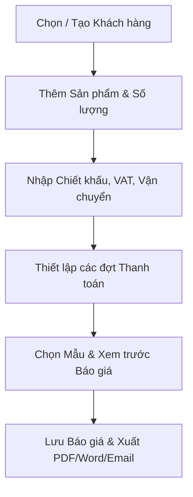
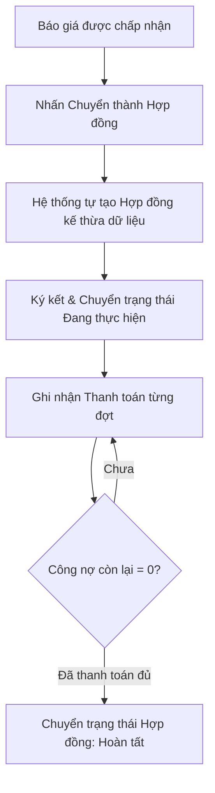

# TÀI LIỆU YÊU CẦU SẢN PHẨM (PRD)

# SellFlow — Hệ thống Quản lý Bán hàng, Báo giá, Hợp đồng & Công nợ

| Thông tin | Nội dung |
| --- | --- |
| Phiên bản | 1.0 — Bản đặc tả yêu cầu sản phẩm MVP |
| Trạng thái | Dự thảo, chờ xác nhận các quyết định nghiệp vụ |
| Ngày | 02/10/2026 |
| Mục đích | Định hướng thiết kế, phát triển và nghiệm thu hệ thống SellFlow |
| Nguồn | Tài liệu khảo sát quy trình bán hàng B2B và quản trị doanh nghiệp vừa & nhỏ |
| Người phê duyệt | **[CẦN XÁC NHẬN]** Product Owner và đại diện doanh nghiệp |

> **Quy ước:** **[CẦN XÁC NHẬN]** là thông tin chính sách/nghiệp vụ chưa được quyết định cứng. **[ĐỀ XUẤT]** là cách làm rõ để đội dự án xem xét; không mặc nhiên là phạm vi đã phê duyệt. Phạm vi Must/Should/Could tuân thủ phân loại MoSCoW.

---

## 1. Tóm tắt điều hành

**SellFlow** là hệ thống phần mềm tập trung giúp doanh nghiệp vừa và nhỏ (SMEs), hộ kinh doanh và các đơn vị thương mại dịch vụ số hóa quy trình bán hàng B2B. Hệ thống kết nối liền mạch chu trình từ **Quản lý danh mục sản phẩm & tồn kho -> Quản lý thông tin khách hàng -> Lập & gửi Báo giá -> Chuyển đổi ký kết Hợp đồng kinh tế -> Quản lý tiến độ thanh toán & Công nợ**.

Phạm vi MVP tập trung vào ba kết quả cốt lõi:
1. **Tạo báo giá và hợp đồng nhanh chóng, chính xác**: Tự động hóa tính toán thuế, chiết khấu, đợt thanh toán và chuyển đổi 1-click từ báo giá sang hợp đồng.
2. **Theo dõi chặt chẽ tiến độ thu tiền và công nợ**: Quản lý từng đợt thanh toán, theo dõi số tiền đã thu và số tiền còn phải thu trên từng hợp đồng.
3. **Nắm bắt bức tranh tổng quan kinh doanh**: Dashboard theo dõi doanh thu lũy kế, tổng công nợ và danh sách đơn hàng theo thời gian thực.

Trong giai đoạn MVP, hệ thống tập trung hoàn thiện luồng nghiệp vụ cho **một pháp nhân/chi nhánh chính với tài khoản đăng nhập nội bộ thống nhất (chưa áp dụng phân quyền vai trò chi tiết)**. Các tính năng mở rộng như phân quyền RBAC, trợ lý AI, ký số điện tử hay cổng thanh toán trực tuyến sẽ được triển khai ở các giai đoạn sau.

---

## 2. Bối cảnh, bài toán và cơ hội

### 2.1. Hiện trạng

Trong thực tế vận hành tại các doanh nghiệp vừa và nhỏ:
- Báo giá và hợp đồng được lập thủ công trên các file Excel, Word rời rạc, làm tăng nguy cơ sai sót đơn giá, tính sai thuế VAT và chiết khấu.
- Khi khách duyệt báo giá, nhân viên phải sao chép dữ liệu bằng tay sang file mẫu hợp đồng, gây mất thời gian và dễ phát sinh độ lệch thông tin giữa báo giá ban đầu và hợp đồng ký kết.
- Khó theo dõi tiến độ thanh toán nhiều đợt của các hợp đồng đang thực hiện, dẫn đến chậm trễ thu hồi công nợ hoặc bỏ sót đợt thanh toán đến hạn.
- Không nắm rõ số lượng hàng tồn kho thực tế khi lên đơn, dễ xảy ra tình trạng bán vượt tồn kho khả dụng.

### 2.2. Tuyên bố vấn đề

> Doanh nghiệp cần một hệ thống quản lý bán hàng tập trung, đảm bảo dữ liệu từ Báo giá được kế thừa trực tiếp sang Hợp đồng và Kế hoạch thanh toán, tự động hóa tính toán tài chính và tồn kho, đồng thời hỗ trợ xuất bản tài liệu in ấn/PDF/Word chuẩn mực cho khách hàng.

### 2.3. Giá trị dự kiến

- Lập báo giá chuyên nghiệp chỉ trong vài phút, chuyển đổi hợp đồng với 1 thao tác, gửi trực tiếp tài liệu cho khách hàng qua email.
- Kiểm soát tiến độ thu tiền theo từng đợt, ghi nhận thanh toán nhanh chóng, theo dõi chính xác công nợ còn lại của từng hợp đồng.
- Cập nhật biến động xuất nhập tồn tức thì, nhận cảnh báo khi sản phẩm chạm ngưỡng tồn tối thiểu.
- Theo dõi bức tranh tổng thể về doanh thu, tỷ lệ chuyển đổi đơn hàng và dòng tiền trên một màn hình Dashboard duy nhất.

---

## 3. Mục tiêu sản phẩm và thước đo

| Mã | Mục tiêu | Chỉ số và cách đo | Mức mục tiêu | Trạng thái |
| --- | --- | --- | --- | --- |
| **G-01** | Giảm thời gian tạo Báo giá | Từ khi chọn khách và sản phẩm đến khi hoàn tất bản báo giá | ≤ 2 phút | Mục tiêu cốt lõi |
| **G-02** | Rút ngắn thời gian lập Hợp đồng | Thời gian chuyển đổi dữ liệu từ Báo giá được duyệt sang Hợp đồng | ≤ 10 giây (1-click) | Điều kiện bắt buộc |
| **G-03** | Đảm bảo tính chính xác tài chính | Số lỗi sai lệch giữa tiền hàng, VAT, chiết khấu và tổng các đợt thanh toán | 0 sai sót | Điều kiện bắt buộc |
| **G-04** | Tăng hiệu quả thu hồi công nợ | Tỷ lệ các đợt thanh toán được ghi nhận đúng hạn và theo dõi đầy đủ | **[CẦN XÁC NHẬN]** baseline | Mục tiêu vận hành |
| **G-05** | Tốc độ phản hồi hệ thống | Thời gian phản hồi của các thao tác dữ liệu và xuất tài liệu | ≤ 2 giây | Tiêu chuẩn chất lượng |

---

## 4. Người dùng mục tiêu và nhu cầu

| Đối tượng sử dụng | Nhu cầu chính trong nghiệp vụ | Tác vụ trên hệ thống MVP |
| --- | --- | --- |
| **Nhân sự Kinh doanh / Bán hàng** | Soạn báo giá nhanh, gửi cho khách duyệt, chuyển đổi hợp đồng dễ dàng | Quản lý khách hàng, tạo báo giá, xuất PDF/Word, gửi email, chuyển đổi hợp đồng |
| **Nhân sự Kế toán / Thu ngân** | Theo dõi tiến độ thu tiền, quản lý công nợ từng hợp đồng, ghi nhận phiếu thanh toán | Xem hợp đồng, ghi nhận thanh toán theo đợt, đối soát công nợ |
| **Nhân sự Kho hàng** | Quản lý số lượng tồn, thực hiện nhập/xuất kho, nhận cảnh báo hết hàng | Xem tồn kho, tạo phiếu nhập/xuất kho, điều chỉnh số lượng tồn |
| **Chủ doanh nghiệp / Quản lý** | Kiểm soát toàn bộ số liệu kinh doanh, cấu hình doanh nghiệp và mẫu tài liệu | Xem Dashboard thống kê, cấu hình mẫu báo giá/hợp đồng, quản lý thông tin doanh nghiệp |

> **Lưu ý phạm vi:** Trong phiên bản MVP hiện tại, hệ thống sử dụng cơ chế đăng nhập và giao diện nội bộ chung cho nhân sự vận hành; việc phân tách ma trận quyền hạn chi tiết từng vai trò sẽ được triển khai ở giai đoạn tiếp theo.

---

## 5. Phạm vi sản phẩm (Product Scope)

### 5.1. Phạm vi MVP bắt buộc (Must Have)

1. **Xác thực, Đăng ký Onboarding & Khởi tạo Doanh nghiệp**:
   - **Đăng ký Onboarding 2 bước**:
     - *Bước 1 — Tạo tài khoản*: Đăng ký email quản trị, mật khẩu (thanh đo độ mạnh mật khẩu) và xác nhận mật khẩu.
     - *Bước 2 — Thiết lập Công ty*: Khai báo Tên doanh nghiệp, tải lên Logo, Mã số thuế, Số điện thoại và Địa chỉ trụ sở.
     - Tự động tạo workspace, gán quyền Quản trị viên tối cao (`ADMIN`), nạp bộ mẫu tài liệu mặc định và đồng bộ thông tin sang **Cài đặt** (`app_settings`) cùng **Cấu hình Email** (`email_settings`).
   - **Đăng nhập & Ghi nhớ phiên**: Đăng nhập bằng Email/Mật khẩu an toàn với tính năng *Ghi nhớ đăng nhập*.
   - **Quên mật khẩu**: Gửi mã xác thực OTP 6 chữ số ngẫu nhiên về email đã đăng ký để đổi mật khẩu mới trực tiếp.
2. **Quản lý Khách hàng**:
   - Lưu trữ danh bạ khách hàng/đối tác (Tên, Mã số thuế, Địa chỉ, Số điện thoại, Email, Người đại diện, Ghi chú).
   - Tự động sinh mã khách hàng theo quy tắc `{PREFIX}-{YEAR}-{SEQ}` (ví dụ: `KH-2026-001`).
   - Xem tổng hợp công nợ và lịch sử báo giá/hợp đồng của từng khách hàng.
3. **Quản lý Sản phẩm & Đơn vị tính**:
   - Quản lý danh mục sản phẩm/dịch vụ (Tên, Giá vốn, Giá bán, Tồn kho, Tồn tối thiểu, Trạng thái).
   - Đơn vị tính (ĐVT) bắt buộc chọn từ danh mục chuẩn hóa của hệ thống (*cái, bộ, gói, mét, kg,...*) để đảm bảo tính đồng bộ dữ liệu.
   - Cảnh báo trực quan khi tồn kho chạm hoặc thấp hơn mức tồn tối thiểu (`stock <= minStock`).
4. **Quản lý Tồn kho cơ bản**:
   - Lập phiếu Nhập kho (Stock In) và Xuất kho (Stock Out).
   - Tự động cập nhật số lượng tồn kho của sản phẩm và lưu nhật ký biến động kho.
5. **Soạn thảo & Quản lý Báo giá**:
   - Chọn khách hàng, thêm nhiều sản phẩm, tự động tính thành tiền từng dòng.
   - Hỗ trợ chiết khấu đơn hàng, thuế GTGT (VAT %) và chi phí vận chuyển.
   - Thiết lập các đợt thanh toán (Installments: tỷ lệ %, số tiền, ngày dự kiến, ghi chú).
   - Xem trước bản in, xuất file PDF, xuất file Word (.docx) và gửi email trực tiếp cho khách.
   - Quản lý trạng thái: *Nháp, Đã gửi, Chấp nhận, Từ chối, Hết hạn*.
6. **Chuyển đổi 1-Click sang Hợp đồng**:
   - Bấm nút **Chuyển thành Hợp đồng** trên Báo giá đã duyệt để tự động tạo Hợp đồng mới.
   - Kế thừa toàn bộ thông tin khách hàng, danh mục hàng hóa, giá trị và tiến độ thanh toán.
   - Liên kết mã báo giá gốc (`quote_id`) để truy vết nguồn gốc.
7. **Quản lý Hợp đồng kinh tế**:
   - Quản lý danh sách hợp đồng, trạng thái: *Nháp, Đang thực hiện, Hoàn tất, Đã hủy*.
   - In ấn và xuất file PDF/Word hợp đồng kinh tế theo mẫu chuẩn.
8. **Quản lý Thanh toán & Công nợ**:
   - Ghi nhận thanh toán từng đợt theo Hợp đồng (phương thức Tiền mặt / Chuyển khoản, ngày thu, số tiền, ghi chú).
   - Tự động tính toán tổng số tiền đã thanh toán và số tiền công nợ còn phải thu (`Tổng tiền HĐ - Đã thanh toán`).
   - Tự động đánh dấu hợp đồng *Hoàn tất* khi công nợ bằng 0.
9. **Quản lý Mẫu tài liệu (Templates)**:
   - Trình biên tập trực quan WYSIWYG mẫu Báo giá & Hợp đồng.
   - Hỗ trợ hệ thống mã biến thay thế dữ liệu (`{{TEN_CONG_TY}}`, `{{BANG_SAN_PHAM}}`, `{{DIEU_KHOAN_THANH_TOAN}}`, `{{TONG_TIEN}}`,...).
   - Nhập file Word mẫu (.docx qua mammoth), khóa mẫu và đặt mẫu mặc định.
10. **Cài đặt Doanh nghiệp & Quy tắc hệ thống**:
    - Cấu hình thông tin công ty, địa chỉ, MST, điện thoại, email, logo.
    - Cấu hình tiền tố và quy tắc sinh mã tự động cho toàn bộ chứng từ.
    - Cấu hình SMTP gửi email thông báo và mã OTP.
11. **Dashboard Tổng quan**:
    - Thống kê doanh thu lũy kế, tổng công nợ phải thu, số lượng báo giá/hợp đồng, tỷ lệ chuyển đổi đơn hàng và biểu đồ doanh số theo thời gian.

---

### 5.2. Các phần việc để ở Giai đoạn sau (Post-MVP / Phase 2)

Các tính năng dưới đây **không nằm trong MVP hiện tại** và sẽ được phát triển ở giai đoạn tiếp theo:

1. **Phân quyền người dùng chi tiết (RBAC)**: Phân tách quyền hạn truy cập theo từng vai trò cụ thể (`ADMIN`, `SALES`, `ACCOUNTANT`).
2. **Trợ lý AI (AI Assistant)**: Tích hợp trợ lý thông minh hỗ trợ gợi ý sản phẩm, soạn thảo nội dung báo giá và phân tích số liệu bán hàng.
3. **Cơ chế tự động trừ tồn kho theo Hợp đồng**: Tự động trừ hoặc khóa giữ số lượng tồn kho ngay khi hợp đồng được ký kết.
4. **Tự động gửi email nhắc nợ định kỳ**: Tự động quét và gửi email nhắc khách hàng khi các đợt thanh toán đến hạn hoặc quá hạn.
5. **Xuất báo cáo công nợ & doanh thu nâng cao ra Excel**: Công cụ kết xuất báo cáo đa chiều phục vụ nghiệp vụ kế toán chuyên sâu.
6. **Ký số điện tử (E-Signature) trực tuyến**: Tích hợp cổng ký điện tử từ xa cho khách hàng.
7. **Tích hợp cổng thanh toán VietQR động**: Tự động sinh mã QR chuyển khoản theo từng đợt thanh toán có sẵn số tiền và nội dung chuyển khoản.

---

### 5.3. Ngoài phạm vi hệ thống (Out of Scope)

- Kê khai và phát hành hóa đơn đỏ điện tử trực tiếp lên cơ quan Thuế.
- Phần mềm hoạch toán kế toán tổng hợp chuyên sâu.
- Quản lý định mức sản xuất và dây chuyền chế tạo (BOM / MRP).
- Tích hợp vận chuyển logistics với các hãng vận chuyển thứ ba (GHN, Viettel Post,...).

---

## 6. Luồng nghiệp vụ người dùng (User Flows)

### 6.1. Luồng Lập và Phát hành Báo giá

1. Người dùng chọn Khách hàng có sẵn trong danh bạ hoặc tạo nhanh Khách hàng mới.
2. Thêm các sản phẩm/dịch vụ từ danh mục, điều chỉnh số lượng và đơn giá thỏa thuận.
3. Thiết lập chiết khấu đơn hàng, tỷ lệ thuế VAT và chi phí vận chuyển (nếu có).
4. Thiết lập kế hoạch thanh toán theo các đợt (tỷ lệ %, số tiền và ngày dự kiến).
5. Chọn mẫu báo giá, kiểm tra bản xem trước tài liệu.
6. Lưu báo giá, xuất file PDF/Word hoặc gửi email trực tiếp cho khách hàng.

### 6.2. Luồng Chuyển đổi Hợp đồng và Thu hồi Công nợ

1. Khi khách hàng đồng ý báo giá, người dùng mở Báo giá và bấm nút **Chuyển thành Hợp đồng**.
2. Hệ thống tự động tạo Hợp đồng mới, sao chép toàn bộ thông tin khách hàng, danh mục hàng hóa, giá trị và tiến độ thanh toán đã thỏa thuận.
3. Các bên tiến hành ký kết hợp đồng; trạng thái hợp đồng chuyển sang **Đang thực hiện**.
4. Khi khách thanh toán từng đợt, người dùng vào chi tiết hợp đồng và bấm **Ghi nhận thanh toán** (nhập số tiền, ngày thu, phương thức).
5. Hệ thống cập nhật tổng số tiền đã thu và tự động tính lại số công nợ còn lại.
6. Khi tất cả các đợt thanh toán hoàn tất (công nợ = 0), hợp đồng tự động được đánh dấu **Hoàn tất**.

---

## 7. Yêu cầu chức năng chi tiết (Functional Requirements)

| ID | Ưu tiên | Yêu cầu nghiệp vụ cốt lõi trong MVP |
| --- | --- | --- |
| **FR-01** | Must | Đăng ký Onboarding 2 bước (Tạo tài khoản quản trị & Thiết lập thông tin công ty); Đăng nhập Email/Password; Quên mật khẩu gửi mã OTP 6 số qua email thật để xác thực đổi mật khẩu mới. |
| **FR-02** | Must | Quản lý danh bạ khách hàng: thêm, sửa, xóa, tìm kiếm, lọc; tự động sinh mã khách hàng (`KH-YYYY-SEQ`). |
| **FR-03** | Must | Quản lý sản phẩm: chọn Đơn vị tính từ danh mục chuẩn hóa; quản lý giá vốn, giá bán, tồn kho, mức tồn tối thiểu. |
| **FR-04** | Must | Quản lý kho: lập phiếu Nhập kho / Xuất kho; cập nhật tồn kho tức thì; cảnh báo khi tồn kho ≤ tồn tối thiểu. |
| **FR-05** | Must | Soạn báo giá: tự tính thành tiền từng dòng, chiết khấu, thuế VAT, phí vận chuyển và tổng cộng thanh toán. |
| **FR-06** | Must | Thiết lập điều khoản thanh toán theo đợt trong Báo giá và Hợp đồng với tỷ lệ %, số tiền và ngày đến hạn. |
| **FR-07** | Must | Chuyển đổi Báo giá sang Hợp đồng với 1 thao tác, tự động sao chép toàn bộ dữ liệu và liên kết mã báo giá gốc. |
| **FR-08** | Must | Quản lý danh sách hợp đồng, theo dõi trạng thái hợp đồng và in ấn/xuất file PDF/Word hợp đồng chuẩn. |
| **FR-09** | Must | Ghi nhận phiếu thanh toán theo hợp đồng (tiền mặt / chuyển khoản); tự động tính tổng đã thu và công nợ còn lại. |
| **FR-10** | Must | Quản lý mẫu Báo giá & Hợp đồng: trình biên tập trực quan với hệ thống biến thay thế, nhập file Word mẫu, đặt mẫu mặc định. |
| **FR-11** | Must | Gửi email Báo giá và Hợp đồng qua cấu hình SMTP; lưu nhật ký gửi mail (`email_logs`). |
| **FR-12** | Must | Cài đặt thông tin pháp nhân doanh nghiệp, logo và quy tắc định dạng mã sinh tự động cho các loại tài liệu. |
| **FR-13** | Must | Dashboard thống kê doanh thu, tổng công nợ phải thu, số lượng đơn hàng và biểu đồ doanh số theo thời gian. |

---

## 8. Quy tắc nghiệp vụ (Business Rules)

| Mã | Quy tắc nghiệp vụ |
| --- | --- |
| **BR-01** | **Tính toán dòng hàng**: `Thành tiền = max(0, Số lượng * Đơn giá - Chiết khấu dòng)`. |
| **BR-02** | **Tính tổng tiền tài liệu**: `Tổng tiền hàng = Tổng các dòng thành tiền`; `Sau chiết khấu = max(0, Tổng tiền hàng - Chiết khấu đơn)`; `Thuế VAT = round(Sau chiết khấu * VAT% / 100)`; `TỔNG CỘNG THANH TOÁN = Sau chiết khấu + Thuế VAT + Phí vận chuyển`. |
| **BR-03** | **Khớp dữ liệu thanh toán**: Tổng tỷ lệ phần trăm (%) các đợt thanh toán phải bằng 100% và tổng số tiền các đợt thanh toán phải bằng chính xác `TỔNG CỘNG THANH TOÁN`. |
| **BR-04** | **Sinh mã chứng từ tự động**: Mã tài liệu được sinh tự động theo mẫu cấu hình `{PREFIX}-{YEAR}-{SEQ}`, trong đó `SEQ` là số thứ tự tăng dần tự động và duy nhất trong hệ thống. |
| **BR-05** | **Bảo toàn dữ liệu lịch sử**: Khi Báo giá đã được chuyển đổi thành Hợp đồng, báo giá chuyển sang trạng thái *Chấp nhận* và không được phép xóa để đảm bảo tính toàn vẹn dữ liệu. |
| **BR-06** | **Tính toán công nợ**: `Công nợ còn lại = TỔNG CỘNG THANH TOÁN - Tổng tiền các phiếu thanh toán đã ghi nhận`. Hợp đồng chỉ được chuyển sang trạng thái *Hoàn tất* khi công nợ bằng 0. |
| **BR-07** | **Đơn vị tính chuẩn**: Đơn vị tính của sản phẩm bắt buộc phải được chọn từ danh mục chuẩn hóa của hệ thống, không cho phép nhập tay tự do để tránh sai lệch dữ liệu. |
| **BR-08** | **Định dạng tiền tệ**: Mọi số tiền hiển thị trên giao diện và tài liệu xuất bản phải tuân theo định dạng chuẩn hóa, phân cách hàng nghìn rõ ràng. |
| **BR-09** | **Xuất bản tài liệu**: Báo giá và Hợp đồng khi xuất PDF/Word phải tự động thay thế đầy đủ các thẻ biến động bằng dữ liệu thực tế và có bố cục trang in hoàn chỉnh. |

### 8.1. Vòng đời Báo giá & Hợp đồng

| Trạng thái ban đầu | Hành động / Sự kiện | Trạng thái tiếp theo | Điều kiện chuyển |
| --- | --- | --- | --- |
| **Nháp** (Báo giá) | Gửi cho khách hàng | **Đã gửi** | Người dùng gửi email hoặc cập nhật trạng thái |
| **Đã gửi** (Báo giá) | Khách đồng ý / Tạo Hợp đồng | **Chấp nhận** | Chuyển đổi thành công sang Hợp đồng |
| **Đã gửi** (Báo giá) | Khách từ chối / Hết hạn | **Từ chối / Hết hạn** | Khách phản hồi hoặc vượt quá ngày hiệu lực |
| **Nháp** (Hợp đồng) | Ký kết hợp đồng | **Đang thực hiện** | Hai bên hoàn tất ký kết |
| **Đang thực hiện** | Thanh toán đủ 100% | **Hoàn tất** | Công nợ còn lại bằng 0 |
| **Đang thực hiện** | Hai bên hủy thỏa thuận | **Đã hủy** | Người dùng cập nhật trạng thái hủy |

---

## 9. Cấu trúc dữ liệu và Tích hợp

### 9.1. Các thực thể dữ liệu cốt lõi

| Thực thể | Thuộc tính chính | Vai trò trong hệ thống |
| --- | --- | --- |
| **User** | ID, email, password, name | Quản lý tài khoản người dùng nội bộ |
| **Customer** | ID (Mã KH), name, phone, email, tax, address, representative, note | Lưu thông tin khách hàng và đối tác B2B |
| **Product** | ID (Mã SP), name, category, unit, cost, price, stock, minStock, status | Lưu danh mục sản phẩm, đơn giá và tồn kho |
| **Quote** | ID (Mã BG), customerId, date, status, discount, vatPct, shipping, paymentTerms, notes, validUntil | Lưu thông tin báo giá và điều khoản thanh toán |
| **QuoteItem** | ID, quoteId, productId, productName, qty, price, discount | Danh mục chi tiết các dòng sản phẩm trong báo giá |
| **Contract** | ID (Mã HĐ), quoteId, customerId, date, status, paymentTerms, notes, stockApplied | Lưu hợp đồng kinh tế và tiến độ thanh toán |
| **ContractItem** | ID, contractId, productId, productName, qty, price | Danh mục chi tiết các dòng sản phẩm trong hợp đồng |
| **Payment** | ID (Mã TT), contractId, date, amount, method, note | Ghi nhận các lần thanh toán theo hợp đồng |
| **InventoryTransaction** | ID (Mã NK), productId, date, type (in/out/adjust), qty, ref, note | Nhật ký các lần nhập / xuất / điều chỉnh kho |
| **Template** | ID, type (quote/contract), name, isDefault, paper, locked, content | Lưu trữ mẫu tài liệu và cấu trúc HTML định dạng |
| **AppSetting** | ID, companyName, companyAddress, companyPhone, companyEmail, companyTax, logoUrl, idFormat, vatDefault, quoteValidDays | Cấu hình thông tin doanh nghiệp và quy tắc hệ thống |

### 9.2. Tích hợp bên ngoài

- **Hạ tầng gửi Email (SMTP)**: Kết nối dịch vụ gửi email để gửi báo giá, hợp đồng và mã OTP xác thực.
- **Cơ sở dữ liệu**: PostgreSQL đảm bảo tính toàn vẹn dữ liệu giao dịch tài chính.
- **Thư viện xuất bản tài liệu**: Tích hợp các bộ thư viện chuyển đổi HTML sang PDF (`html2pdf.js`) và Word (.docx qua định dạng Office XML).

---

## 10. Danh sách màn hình và Định hướng UX

| Phân hệ | Màn hình | Nội dung và tác vụ chính |
| --- | --- | --- |
| **Tổng quan** | Dashboard | Các thẻ chỉ số tổng hợp, biểu đồ doanh thu, danh sách báo giá và hợp đồng mới |
| **Khách hàng** | Danh sách & Chi tiết Khách hàng | Bảng tra cứu khách hàng, form thêm/sửa, xem lịch sử báo giá/hợp đồng của khách |
| **Sản phẩm & Kho** | Quản lý Sản phẩm / Tồn kho | Danh mục sản phẩm, cảnh báo hết hàng, form lập phiếu nhập/xuất kho nhanh |
| **Báo giá** | Quản lý & Soạn thảo Báo giá | Bảng báo giá, form soạn thảo nhiều dòng sản phẩm, modal chia đợt thanh toán, xem trước & xuất tài liệu |
| **Hợp đồng** | Quản lý & Soạn thảo Hợp đồng | Bảng hợp đồng, form soạn thảo, theo dõi tiến độ thanh toán, in ấn và xuất file hợp đồng |
| **Thanh toán** | Quản lý Thanh toán & Công nợ | Bảng theo dõi các đợt thanh toán, form ghi nhận phiếu thu tiền theo từng hợp đồng |
| **Mẫu tài liệu** | Quản lý Mẫu Báo giá & Hợp đồng | Danh sách mẫu, trình soạn thảo trực quan, công cụ chèn biến thay thế dữ liệu |
| **Cài đặt** | Cài đặt Doanh nghiệp & Hệ thống | Cấu hình thông tin công ty, logo, quy tắc sinh mã, cấu hình email |
| **Xác thực** | Đăng nhập, Onboarding & Quên mật khẩu | Giao diện đăng nhập, form Onboarding 2 bước (Tạo tài khoản & Thiết lập công ty), form nhập email nhận OTP khôi phục mật khẩu |

---

## 11. Yêu cầu phi chức năng (NFR)

| Mã | Nhóm | Yêu cầu kỹ thuật |
| --- | --- | --- |
| **NFR-01** | **Hiệu năng** | Thời gian phản hồi của các thao tác dữ liệu ≤ 1.5 giây; thời gian kết xuất tài liệu PDF/Word ≤ 3 giây. |
| **NFR-02** | **Bảo mật** | Mật khẩu người dùng được băm an toàn; xác thực phiên làm việc bảo mật trước khi truy cập hệ thống. |
| **NFR-03** | **Toàn vẹn dữ liệu** | Sử dụng ràng buộc khóa ngoại trong CSDL; các phép tính toán tiền tệ và công nợ bảo đảm không bị sai lệch số học. |
| **NFR-04** | **Tính tương thích** | Giao diện hoạt động mượt mà trên các trình duyệt hiện đại (Chrome, Edge, Safari, Firefox) trên Desktop và Tablet. |
| **NFR-05** | **Khả năng kiểm toán (Audit)** | Lưu trữ nhật ký biến động kho và lịch sử gửi email để phục vụ đối soát và tra cứu khi cần thiết. |
| **NFR-06** | **Độ tin cậy** | Các lỗi kết nối mạng hoặc lỗi gửi mail bên ngoài không làm gián đoạn việc lưu trữ dữ liệu nghiệp vụ cốt lõi. |

---

## 12. Tiêu chí nghiệm thu (Acceptance Criteria)

| Mã | Tình huống kiểm thử | Tiêu chí đạt |
| --- | --- | --- |
| **AC-01** | Tạo khách hàng và sản phẩm mới | Dữ liệu được lưu chính xác; mã khách hàng/sản phẩm tự động sinh đúng quy tắc cấu hình. |
| **AC-02** | Soạn Báo giá có thuế VAT và chiết khấu | Hệ thống tính toán đúng 100% thành tiền từng dòng, tiền thuế, tiền chiết khấu và tổng cộng thanh toán. |
| **AC-03** | Thiết lập điều khoản thanh toán theo đợt | Bảng các đợt thanh toán được lưu đầy đủ; tổng số tiền các đợt khớp chính xác với tổng tiền báo giá. |
| **AC-04** | Chuyển đổi Báo giá thành Hợp đồng | Hợp đồng mới được tạo ngay lập tức với đầy đủ sản phẩm, giá trị, khách hàng và điều khoản thanh toán kế thừa từ báo giá. |
| **AC-05** | Ghi nhận thanh toán và tính công nợ | Số tiền đã thanh toán tăng lên, công nợ còn lại giảm tương ứng; cập nhật đồng bộ lên Dashboard. |
| **AC-06** | Xuất bản file PDF và Word | Tài liệu xuất ra có đầy đủ thông tin doanh nghiệp, khách hàng, bảng sản phẩm và điều khoản thanh toán. |
| **AC-07** | Nhập kho và cảnh báo tồn kho | Số lượng tồn kho tăng đúng theo phiếu nhập; sản phẩm hiển thị cảnh báo khi số lượng tồn ≤ mức tồn tối thiểu. |
| **AC-08** | Khôi phục mật khẩu qua email OTP | Nhập đúng email đã đăng ký, hệ thống gửi mã OTP xác thực; nhập đúng OTP cho phép đổi mật khẩu mới thành công. |
| **AC-09** | Bảo mật xác thực người dùng | Người dùng chưa đăng nhập không thể truy cập các trang nghiệp vụ nội bộ. |
| **AC-10** | Đăng ký Onboarding và Khởi tạo Doanh nghiệp | Đăng ký tài khoản qua 2 bước, hệ thống tự động gán quyền Quản trị viên tối cao, tự động đồng bộ Tên công ty & Logo sang Cài đặt, Báo giá, Hợp đồng và Cấu hình Email. |

---

## 13. Kịch bản trình diễn tham chiếu (Demo Flow)

1. **Chuẩn bị dữ liệu**: Hệ thống đã có danh mục sản phẩm thiết bị văn phòng, mức tồn kho và danh bạ khách hàng doanh nghiệp.
2. **Lập Báo giá**: Người dùng tạo báo giá mới cho khách hàng, thêm 3 sản phẩm, áp dụng thuế VAT 10%, chia 3 đợt thanh toán (40% - 30% - 30%), xem trước bản in và xuất file PDF gửi khách.
3. **Chuyển đổi Hợp đồng**: Khi khách chốt đơn, người dùng bấm nút **Chuyển thành Hợp đồng**. Hệ thống tự động sinh Hợp đồng kinh tế mới kế thừa đầy đủ dữ liệu.
4. **Ký kết & Ghi nhận Thanh toán**: Hợp đồng chuyển sang trạng thái thực hiện. Ghi nhận đợt thanh toán 1 (40% qua chuyển khoản ngân hàng). Hệ thống tự động trừ và hiển thị chính xác số tiền công nợ còn lại 60%.
5. **Theo dõi Dashboard**: Màn hình tổng quan cập nhật tức thì doanh thu mới ghi nhận và danh sách đơn hàng đang thực hiện.

---

**Tài liệu được sử dụng làm căn cứ phát triển và nghiệm thu cho dự án SellFlow.**
