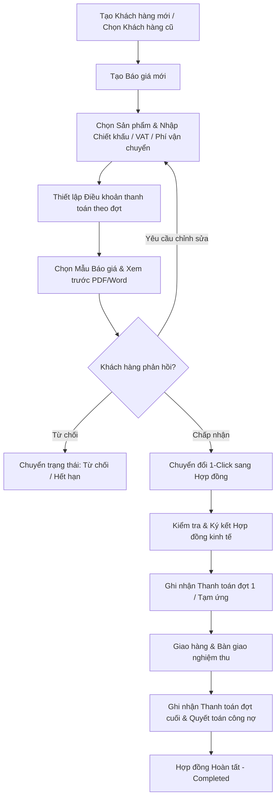
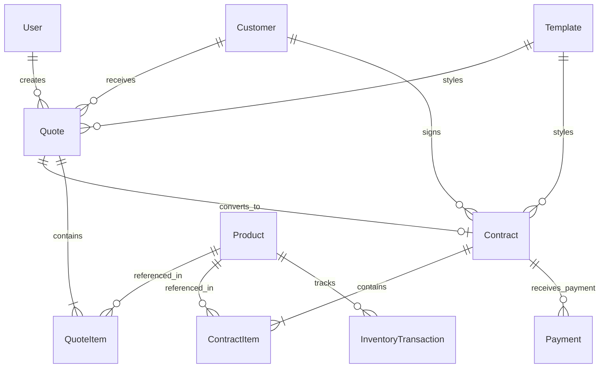

# TÀI LIỆU YÊU CẦU SẢN PHẨM (PRD)

# SellFlow — Hệ thống Quản lý Bán hàng, Báo giá, Hợp đồng & Công nợ Doanh nghiệp

| Thông tin | Nội dung |
| --- | --- |
| Phiên bản | 1.0 — Bản đặc tả chuẩn hóa toàn diện |
| Trạng thái | Đã hoàn thiện cấu trúc & sẵn sàng nghiệm thu vận hành |
| Ngày | 02/10/2026 |
| Mục đích | Định hướng thiết kế, phát triển, kiểm thử và nghiệm thu hệ thống SellFlow |
| Nguồn | Hệ thống mã nguồn và cơ sở dữ liệu thực tế SellFlow |
| Người phê duyệt | **[CẦN XÁC NHẬN]** Product Owner / Ban Giám đốc Doanh nghiệp |

> **Quy ước:** **[CẦN XÁC NHẬN]** là thông tin chính sách mở rộng chưa được chốt cứng. **[ĐỀ XUẤT]** là giải pháp tối ưu kỹ thuật đã được hiện thực hóa trong mã nguồn. Phạm vi tính năng tuân thủ nghiêm ngặt chuẩn MoSCoW (Must / Should / Could / Won't).

---

## 1. Tóm tắt điều hành

**SellFlow** là hệ thống phần mềm quản trị tập trung quy trình bán hàng B2B và dịch vụ dành cho doanh nghiệp vừa và nhỏ (SMEs), hộ kinh doanh và các đơn vị thương mại dịch vụ. Hệ thống số hóa liền mạch toàn bộ chu trình từ **Quản lý danh mục sản phẩm & kho hàng -> Quản lý hồ sơ khách hàng -> Soạn thảo & phát hành Báo giá -> Chuyển đổi ký kết Hợp đồng kinh tế -> Theo dõi tiến độ thanh toán & Công nợ**.

Hệ thống giải quyết triệt để sự rời rạc khi dùng Excel, Word và phần mềm kế toán độc lập bằng cách cung cấp công cụ tự động hóa tính toán thuế/chiết khấu, sinh mã định danh theo quy tắc nghiệp vụ, biên tập mẫu tài liệu chuẩn in ấn/PDF/Word (font *Times New Roman 12pt*, tiêu đề *16pt*, tiền tệ dấu chấm `.` chuẩn Việt Nam), gửi email đính kèm và báo cáo dashboard thời gian thực.

---

## 2. Bối cảnh, bài toán và cơ hội

### 2.1. Hiện trạng

Trong các doanh nghiệp B2B và thương mại dịch vụ truyền thống:
- **Soạn báo giá & hợp đồng thủ công**: Nhân viên kinh doanh mất từ 30–60 phút để cắt dán dữ liệu trên Excel/Word, dễ gõ sai đơn giá, sai công thức tính VAT, sai thông tin pháp lý của khách hàng.
- **Thất lạc và lệch số liệu**: Báo giá gửi cho khách một giá, khi lên hợp đồng lại sửa tay dẫn đến không kiểm soát được phiên bản; kế toán không nắm được điều khoản thanh toán theo đợt để thu tiền đúng hạn.
- **Tồn kho mù mờ**: Không nắm rõ số lượng hàng khả dụng khi lên đơn, dẫn đến tình trạng ký hợp đồng bán hàng vượt quá khả năng cung ứng trong kho.
- **Định dạng văn bản lộn xộn**: Xuất file Word/PDF bị vỡ layout, nhảy trang, phông chữ không đồng bộ, dấu phân cách số tiền lộn xộn giữa chuẩn Mỹ (dấu phẩy `,`) và chuẩn kế toán Việt Nam (dấu chấm `.`).

### 2.2. Tuyên bố vấn đề

> Doanh nghiệp cần một giải pháp khép kín, bảo đảm dữ liệu từ Báo giá chuyển thẳng sang Hợp đồng và Kế hoạch thanh toán mà không cần nhập liệu lại, tự động tính toán tồn kho, đồng thời tự động xuất bản các chứng từ pháp lý chuẩn chỉ, chuẩn phông chữ in ấn văn phòng Việt Nam.

### 2.3. Giá trị cốt lõi mang lại

- **Tiết kiệm 80% thời gian** tạo báo giá và hợp đồng thông qua cơ chế 1-Click Conversion và hệ thống biến động `{{...}}`.
- **Chính xác tuyệt đối** trong tính toán: Tổng tiền hàng, chiết khấu dòng, chiết khấu đơn, thuế VAT, chi phí vận chuyển và chia đợt thanh toán (Installments).
- **Kiểm soát dòng tiền & công nợ**: Cảnh báo đợt thanh toán đến hạn, quản lý tổng số tiền đã thu và số tiền còn phải thu trên từng hợp đồng.
- **Chuẩn hóa văn bản in ấn**: Đồng bộ 100% font *Times New Roman*, cỡ chữ *12pt*, tiêu đề *16pt*, màu chữ đen `#000000`, phân cách hàng nghìn bằng dấu chấm `.` (ví dụ: `15.500.000đ`), màu nền bảng `#f1f5f9`.

---

## 3. Mục tiêu sản phẩm và thước đo

| Mã | Mục tiêu | Chỉ số và cách đo | Mức mục tiêu | Trạng thái |
| --- | --- | --- | --- | --- |
| **G-01** | Tối ưu thời gian tạo Báo giá | Thời gian từ khi chọn khách + hàng đến khi có file PDF/Word | ≤ 2 phút | Đã đạt |
| **G-02** | Chuyển đổi Báo giá -> Hợp đồng | Thời gian nhân bản dữ liệu sang Hợp đồng | 1 click (< 1 giây) | Đã đạt |
| **G-03** | Độ chính xác tính toán tài chính | Tỷ lệ sai lệch giữa tổng tiền hàng, VAT và các đợt thanh toán | 0% sai sót | Bắt buộc |
| **G-04** | Chuẩn hóa định dạng xuất bản | Tỷ lệ tài liệu PDF/Word đúng font Times New Roman 12pt, tiền tệ dấu `.` | 100% | Bắt buộc |
| **G-05** | Tự động hóa gửi email | Tỷ lệ gửi thành công email báo giá/hợp đồng và mã OTP khôi phục | ≥ 99% | Đã đạt |
| **G-06** | Tốc độ phản hồi giao diện | Thời gian tải trang chính và thực thi thao tác dữ liệu | ≤ 1.5 giây | Đã đạt |

---

## 4. Người dùng mục tiêu và nhu cầu

| Nhóm người dùng | Nhu cầu chính | Tác vụ trọng tâm trong hệ thống |
| --- | --- | --- |
| **Nhân viên Kinh doanh (Sales)** | Lên báo giá nhanh, gửi khách duyệt, chuyển đổi hợp đồng khi chốt sale, theo dõi tình trạng đơn | Tạo báo giá, chọn mẫu, xuất PDF/Word, gửi email cho khách, chuyển thành hợp đồng |
| **Kế toán / Thu ngân (Accountant)** | Theo dõi tiến độ thanh toán theo đợt, ghi nhận tiền về, quản lý công nợ khách hàng | Quản lý hợp đồng, ghi nhận phiếu thu/thanh toán, kiểm tra công nợ còn lại |
| **Thủ kho (Inventory Staff)** | Nắm bắt số lượng tồn, cảnh báo hết hàng, nhập kho/xuất kho chính xác | Xem danh sách hàng tồn, thực hiện phiếu nhập kho, theo dõi biến động tồn |
| **Quản trị viên / Giám đốc (Admin/Owner)** | Nắm bắt bức tranh tổng quan doanh thu, biên lợi nhuận, chuẩn hóa quy định công ty | Xem Dashboard, cấu hình thông tin doanh nghiệp, quản lý người dùng, chỉnh sửa mẫu hợp đồng/báo giá mẫu |

---

## 5. Phạm vi sản phẩm (Scope & MoSCoW)

### 5.1. Phạm vi bắt buộc (Must Have - MVP)

1. **Xác thực & Phân quyền**: Đăng nhập, đăng xuất, quên mật khẩu qua mã OTP gửi về email, phân quyền 3 vai trò: `ADMIN`, `SALES`, `ACCOUNTANT`.
2. **Quản lý Khách hàng (CRM)**: Mã khách hàng tự sinh, tên công ty, MST, địa chỉ, số điện thoại, email, người đại diện, ghi chú và lịch sử giao dịch.
3. **Quản lý Sản phẩm & Đơn vị tính (DVT)**: Tên, danh mục, đơn vị tính (chọn từ danh mục chuẩn: *cái, bộ, gói, mét, kg,...* tránh nhập tay), giá vốn, giá bán, tồn kho, mức tồn tối thiểu, cảnh báo hết hàng.
4. **Quản lý Kho hàng (Inventory)**: Phiếu nhập kho (Stock In), xuất kho (Stock Out), điều chỉnh, cập nhật tồn kho tức thì.
5. **Soạn thảo & Phát hành Báo giá (Quotations)**:
   - Thêm sản phẩm, điều chỉnh số lượng, đơn giá, chiết khấu dòng, chiết khấu đơn, thuế GTGT (VAT %), phí vận chuyển.
   - Thiết lập điều khoản thanh toán theo đợt (Tỷ lệ %, ngày đến hạn, số tiền, ghi chú).
   - Chọn mẫu giao diện báo giá, xuất file PDF trực tiếp, xuất file Word (.docx), gửi email đính kèm.
   - Đổi trạng thái: *Nháp*, *Đã gửi*, *Chấp nhận*, *Từ chối*, *Hết hạn*.
6. **Quản lý Hợp đồng kinh tế (Contracts)**:
   - Tạo mới hoặc chuyển đổi trực tiếp 1-click từ Báo giá.
   - Kế thừa toàn bộ danh mục hàng hóa, giá trị và tiến độ thanh toán.
   - Xuất bản hợp đồng chuẩn pháp lý Việt Nam: Quốc hiệu, Tiêu ngữ, Căn cứ pháp luật, Điều khoản Bên A / Bên B, chữ ký và con dấu.
7. **Quản lý Thanh toán & Công nợ (Payments)**:
   - Ghi nhận thanh toán từng đợt theo Hợp đồng (Số tiền, phương thức Tiền mặt / Chuyển khoản, ngày thu, ghi chú).
   - Tự động tính: *Tổng tiền hợp đồng*, *Đã thanh toán*, *Còn phải thu (Công nợ)*.
8. **Biên tập & Quản lý Mẫu tài liệu (Document Templates)**:
   - Trình soạn thảo trực quan WYSIWYG có hệ thống mã biến thay thế (`{{TEN_CONG_TY}}`, `{{BANG_SAN_PHAM}}`, `{{TONG_TIEN}}`, `{{DIEU_KHOAN_THANH_TOAN}}`,...).
   - Hỗ trợ nhập file Word mẫu (.docx qua mammoth), khóa/mở khóa mẫu, đặt làm mặc định.
9. **Cấu hình Doanh nghiệp & Sinh mã tự động (Settings)**:
   - Thông tin pháp nhân công ty, logo, thuế VAT mặc định, hạn hiệu lực báo giá mặc định.
   - Cấu hình tiền tố và định dạng mã sinh tự động: `{PREFIX}-{YEAR}-{SEQ}` (ví dụ: `BG-2026-001`, `HD-2026-001`, `KH-2026-001`).
10. **Dashboard Thống kê**: Doanh thu lũy kế, tổng công nợ phải thu, số lượng báo giá/hợp đồng trong kỳ, biểu đồ doanh số theo thời gian.

### 5.2. Phạm vi ưu tiên tiếp theo (Should Have)

- Tự động trừ tồn kho khi ký kết/kích hoạt hợp đồng (`stockApplied`).
- Nhắc hạn thanh toán tự động qua email khi đến ngày của đợt thanh toán.
- Bộ lọc nâng cao theo khoảng thời gian và xuất báo cáo doanh số ra Excel.

### 5.3. Phạm vi xem xét giai đoạn sau (Could Have)

- Ký số điện tử (Digital Signature / E-sign) trực tuyến qua cổng bảo mật.
- Tích hợp cổng thanh toán trực tuyến (VietQR động tự điền số tiền và nội dung chuyển khoản).
- Phân hệ quản lý hoa hồng cho nhân viên kinh doanh (Sales Commission).

### 5.4. Ngoài phạm vi hệ thống (Out of Scope)

- Kế toán thuế chuyên sâu (kê khai hóa đơn đỏ điện tử trực tiếp sang Tổng cục Thuế).
- Quản lý dây chuyền sản xuất phức tạp (BOM / MRP).
- Quản lý vận chuyển logistic tích hợp các đơn vị giao hàng thứ 3 (GHN, Viettel Post).

---

## 6. Luồng nghiệp vụ người dùng (User Flows)

### 6.1. Luồng Bán hàng khép kín (Lead-to-Cash)

### 6.2. Luồng Xử lý Quản lý Mẫu và Xuất bản In ấn

1. Người dùng chọn chức năng **In ấn** hoặc **Tải PDF / Word** từ chi tiết Báo giá hoặc Hợp đồng.
2. Hệ thống thu thập dữ liệu thực tế (Khách hàng, Sản phẩm, Bảng tính tiền, Điều khoản thanh toán, Thông tin doanh nghiệp).
3. Hệ thống nạp mẫu giao diện HTML đã chọn và thực hiện thay thế toàn bộ mã biến `{{TAG}}` bằng HTML/text thực tế.
4. Áp dụng chuẩn in ấn:
   - Font: `Times New Roman, Times, serif`.
   - Cỡ chữ thân bài: `12pt`, màu chữ đen `#000000`.
   - Tiêu đề văn bản: `16pt`, in hoa, căn giữa.
   - Bảng biểu: border `1px solid #000000`, nền tiêu đề và tổng cộng `#f1f5f9`.
   - Dấu phân cách tiền tệ: Dấu chấm `.` (ví dụ: `45.500.000đ`).
5. Render ra canvas hoặc HTML wrapper tải về qua thư viện `html2pdf.js` / Word XML Document.

---

## 7. Yêu cầu chức năng chi tiết

| Mã FR | Phân hệ | Yêu cầu nghiệp vụ chi tiết | Mức |
| --- | --- | --- | --- |
| **FR-01** | Xác thực | Đăng nhập bằng Email/Password; Quên mật khẩu gửi mã OTP 6 số ngẫu nhiên về email đã đăng ký; Đổi mật khẩu bảo mật. | Must |
| **FR-02** | Khách hàng | Thêm, sửa, xóa, tìm kiếm, lọc khách hàng; Tự động sinh mã `KH-YYYY-SEQ`; Lưu đầy đủ MST, địa chỉ, người đại diện. | Must |
| **FR-03** | Sản phẩm | Quản lý danh mục sản phẩm/dịch vụ; Chọn Đơn vị tính từ danh sách cố định (cái, bộ, gói, mét, kg,...); Quản lý giá vốn, giá bán, tồn kho, min-stock. | Must |
| **FR-04** | Kho hàng | Tạo phiếu Nhập kho (Stock In) / Xuất kho (Stock Out); Lịch sử biến động tồn kho; Cảnh báo trực quan khi tồn kho ≤ min-stock. | Must |
| **FR-05** | Báo giá | Soạn báo giá: chọn khách, thêm nhiều dòng sản phẩm, tự tính thành tiền, chiết khấu %, VAT %, phí vận chuyển, tổng tiền. | Must |
| **FR-06** | Điều khoản TT | Thiết lập bảng thanh toán nhiều đợt trong Báo giá/Hợp đồng (Đợt 1, Đợt 2,... % tỷ lệ, số tiền tương ứng, ngày hẹn, ghi chú). | Must |
| **FR-07** | Chuyển đổi HĐ | Chuyển Báo giá thành Hợp đồng với 1 nút bấm: kế thừa toàn bộ danh sách sản phẩm, giá trị, khách hàng, tiến độ thanh toán và liên kết mã `quote_id`. | Must |
| **FR-08** | Hợp đồng | Quản lý danh sách hợp đồng, trạng thái (Nháp, Hiệu lực, Hoàn tất, Hủy); In ấn & xuất PDF/Word hợp đồng chuẩn mẫu kinh tế Việt Nam. | Must |
| **FR-09** | Thanh toán | Ghi nhận thanh toán từng đợt theo hợp đồng; Chọn phương thức Tiền mặt / Chuyển khoản; Tự động tính số tiền đã thu và công nợ còn lại. | Must |
| **FR-10** | Mẫu tài liệu | Trình biên tập WYSIWYG mẫu Báo giá & Hợp đồng; Chèn biến động; Nhập file Word mẫu (.docx); Đặt mẫu mặc định; Khóa mẫu chống sửa nhầm. | Must |
| **FR-11** | Gửi Email | Gửi Báo giá / Hợp đồng trực tiếp cho khách qua SMTP cấu hình; Lưu nhật ký `email_logs`; Gửi mã OTP xác thực mật khẩu. | Must |
| **FR-12** | Cấu hình | Cài đặt thông tin công ty (Tên, MST, Địa chỉ, SĐT, Email, Logo); Cài đặt quy tắc sinh mã tự động cho toàn bộ chứng từ. | Must |
| **FR-13** | Dashboard | Biểu đồ doanh thu theo thời gian, tỷ lệ chuyển đổi báo giá -> hợp đồng, tổng công nợ phải thu, danh sách đơn hàng mới nhất. | Must |
| **FR-14** | Trừ kho tự động | Đánh dấu áp dụng trừ kho (`stockApplied = true`) khi kích hoạt hợp đồng. | Should |
| **FR-15** | Nhắc nợ tự động | Cảnh báo các đợt thanh toán quá hạn trên màn hình Thanh toán và Dashboard. | Should |

### 7.1. Ma trận phân quyền người dùng (Role-Based Access Control)

| Tính năng / Nghiệp vụ | ADMIN | SALES | ACCOUNTANT |
| --- | :---: | :---: | :---: |
| Xem Dashboard thống kê | Toàn quyền | Doanh số cá nhân | Toàn quyền tài chính |
| Quản lý Khách hàng | Toàn quyền | Toàn quyền | Xem & Cập nhật |
| Quản lý Sản phẩm & ĐVT | Toàn quyền | Chỉ xem | Chỉ xem |
| Nhập / Xuất kho hàng | Toàn quyền | Không có quyền | Xem lịch sử |
| Tạo & Sửa Báo giá | Toàn quyền | Toàn quyền | Xem |
| Chuyển Báo giá thành Hợp đồng | Toàn quyền | Toàn quyền | Xem |
| Quản lý Hợp đồng | Toàn quyền | Tạo & Theo dõi | Toàn quyền |
| Ghi nhận Thanh toán & Công nợ | Toàn quyền | Xem tiến độ | Toàn quyền thu tiền |
| Quản lý Mẫu tài liệu (Templates) | Toàn quyền | Chỉ sử dụng | Chỉ sử dụng |
| Cấu hình Hệ thống & Doanh nghiệp | Toàn quyền | Không có quyền | Không có quyền |

---

## 8. Quy tắc nghiệp vụ (Business Rules)

| Mã BR | Quy tắc nghiệp vụ |
| --- | --- |
| **BR-01** | **Công thức tính dòng sản phẩm**: `Thành tiền = max(0, Số lượng * Đơn giá - Chiết khấu dòng)`. |
| **BR-02** | **Công thức tính tổng tiền Báo giá/Hợp đồng**: `Tổng tiền hàng (Tạm tính) = Tổng các dòng thành tiền`; `Sau chiết khấu = max(0, Tạm tính - Chiết khấu đơn)`; `Thuế VAT = round(Sau chiết khấu * VAT% / 100)`; `TỔNG CỘNG THANH TOÁN = Sau chiết khấu + Thuế VAT + Phí vận chuyển`. |
| **BR-03** | **Điều khoản thanh toán**: Tổng tỷ lệ phần trăm (%) các đợt thanh toán phải bằng 100% và tổng số tiền các đợt phải khớp với `TỔNG CỘNG THANH TOÁN`. |
| **BR-04** | **Quy tắc sinh mã chứng từ**: Mã định danh tự sinh theo cấu trúc `{PREFIX}-{YEAR}-{SEQ}` (ví dụ: `BG-2026-001`, `HD-2026-001`, `KH-2026-001`, `NK-2026-001`). Số thứ tự `SEQ` tự tăng 3 chữ số và duy nhất trong hệ thống. |
| **BR-05** | **Tính bất biến của Báo giá sau khi chuyển Hợp đồng**: Khi Báo giá đã chuyển thành Hợp đồng (`contracts.quote_id = quotes.id`), Báo giá chuyển trạng thái `Chấp nhận` và không được xóa trực tiếp để bảo đảm tính toàn vẹn dữ liệu lịch sử. |
| **BR-06** | **Tính toán công nợ**: `Công nợ còn lại (Còn phải thu) = TỔNG CỘNG THANH TOÁN - Tổng tiền các phiếu thanh toán đã ghi nhận`. Hợp đồng chỉ chuyển sang trạng thái `Hoàn tất` (Completed) khi công nợ bằng 0. |
| **BR-07** | **Đơn vị tính sản phẩm**: Không cho phép nhập tay tự do trong form tạo sản phẩm; bắt buộc chọn từ danh mục Đơn vị tính chuẩn của hệ thống để tránh sai sót chính tả khi xuất hợp đồng. |
| **BR-08** | **Định dạng tiền tệ chuẩn**: Số tiền luôn được phân cách hàng nghìn bằng dấu chấm `.` (ví dụ `15.500.000đ`), không dùng dấu phẩy `,` ngăn cách hàng nghìn. |
| **BR-09** | **Định dạng in ấn & xuất bản**: Mọi mẫu in Báo giá và Hợp đồng bắt buộc áp dụng font chữ `Times New Roman`, cỡ chữ nội dung `12pt`, tiêu đề `16pt`, màu chữ đen `#000000`, màu nền tiêu đề bảng và dòng tổng cộng `#f1f5f9`. |
| **BR-10** | **Quản lý Tồn kho**: Khi tạo phiếu Nhập kho (`type = "in"`), tồn kho sản phẩm tăng tương ứng; khi Xuất kho (`type = "out"`), tồn kho giảm tương ứng. Cảnh báo hiển thị khi `stock <= minStock`. |

---

## 9. Cấu trúc dữ liệu và Thực thể hệ thống

### 9.1. Chi tiết các thực thể cốt lõi

1. **User (`users`)**: Tài khoản nhân sự, email, mật khẩu mã hóa, vai trò (`ADMIN`, `SALES`, `ACCOUNTANT`).
2. **Customer (`customers`)**: Mã `KH-XXXX-XXX`, tên công ty, MST, địa chỉ, người đại diện, số điện thoại, email, ghi chú.
3. **Product (`products`)**: Mã `SP-XXXX-XXX`, tên, danh mục, đơn vị tính (`unit`), giá vốn (`cost`), giá bán (`price`), tồn kho (`stock`), mức tồn tối thiểu (`minStock`), trạng thái.
4. **Quote (`quotes`)**: Mã `BG-XXXX-XXX`, khách hàng, ngày lập, hạn hiệu lực, chiết khấu, % VAT, phí vận chuyển, tiến độ thanh toán (`payment_terms` JSON), mẫu tài liệu, ghi chú, trạng thái.
5. **QuoteItem (`quote_items`)**: Sản phẩm, tên sản phẩm chụp tại thời điểm lập, số lượng, đơn giá, chiết khấu dòng.
6. **Contract (`contracts`)**: Mã `HD-XXXX-XXX`, liên kết `quote_id`, khách hàng, ngày ký, tiến độ thanh toán (`payment_terms` JSON), trạng thái, cờ trừ kho (`stockApplied`).
7. **ContractItem (`contract_items`)**: Sản phẩm, tên sản phẩm, số lượng, đơn giá.
8. **Payment (`payments`)**: Mã `TT-XXXX-XXX`, hợp đồng, ngày thu, số tiền, phương thức (Tiền mặt / Chuyển khoản), ghi chú.
9. **InventoryTransaction (`inventory_transactions`)**: Mã `NK-XXXX-XXX`, ngày giao dịch, sản phẩm, loại (`in`/`out`/`adjust`), số lượng, chứng từ tham chiếu (`ref`), ghi chú.
10. **Template (`templates`)**: Mã mẫu, loại (`quote`/`contract`), tên mẫu, nội dung HTML có mã biến, khổ giấy A4, cờ mặc định, cờ khóa.
11. **AppSetting (`app_settings`)**: Thông tin pháp nhân công ty, logo, quy tắc sinh mã, VAT mặc định, số ngày hiệu lực báo giá.

---

## 10. Danh sách màn hình và Tiêu chuẩn giao diện (UI/UX)

| Phân hệ | Màn hình | Mục đích & Thành phần chính |
| --- | --- | --- |
| **Tổng quan** | `/dashboard` | Thẻ KPI (Doanh thu, Báo giá, Hợp đồng, Công nợ), Biểu đồ doanh số, Danh sách báo giá mới & hợp đồng sắp tới. |
| **Khách hàng** | `/customers` | Bảng danh bạ khách hàng, Thanh tìm kiếm, Bộ lọc, Modal thêm/sửa khách hàng, Xem lịch sử giao dịch & công nợ. |
| **Sản phẩm** | `/products` | Bảng sản phẩm, Bộ lọc danh mục, Cảnh báo hết hàng, Modal thêm/sửa sản phẩm với dropdown chọn ĐVT chuẩn. |
| **Kho hàng** | `/inventory` | Thống kê tồn kho, Danh sách phiếu nhập/xuất kho, Modal lập phiếu Nhập kho / Xuất kho nhanh. |
| **Báo giá** | `/quotations` | Danh sách báo giá, Bộ lọc trạng thái, Drawer/Trang soạn báo giá chi tiết, Modal chọn đợt thanh toán, Modal Xem trước & Xuất PDF/Word, Nút chuyển đổi Hợp đồng. |
| **Hợp đồng** | `/contracts` | Danh sách hợp đồng, Bộ lọc trạng thái, Drawer/Trang soạn hợp đồng, Xem chi tiết tiến độ thanh toán, In ấn & Tải PDF/Word hợp đồng chuẩn. |
| **Thanh toán** | `/payments` | Danh sách các đợt thanh toán, Thống kê tổng đã thu và công nợ, Modal ghi nhận phiếu thu tiền theo từng hợp đồng. |
| **Mẫu tài liệu** | `/templates` | Danh sách mẫu Báo giá & Hợp đồng, Trình soạn thảo trực quan WYSIWYG, Chèn biến động, Nhập file Word mẫu, Xem trước bản in. |
| **Cài đặt** | `/settings` | Thông tin công ty & logo, Cấu hình quy tắc sinh mã, Cấu hình email SMTP, Quản lý tài khoản người dùng & phân quyền. |
| **Đăng nhập** | `/login` | Đăng nhập hệ thống, Modal Quên mật khẩu nhập email nhận OTP 6 số để thiết lập lại mật khẩu mới. |

---

## 11. Yêu cầu phi chức năng (NFR)

| Mã | Nhóm | Yêu cầu kỹ thuật |
| --- | --- | --- |
| **NFR-01** | **Hiệu năng (Performance)** | Thời gian render giao diện các trang danh sách ≤ 1 giây; thời gian tính toán và xuất file PDF/Word ≤ 2.5 giây. |
| **NFR-02** | **Bảo mật (Security)** | Mật khẩu băm an toàn; xác thực JWT / Session Token; chặn truy cập dữ liệu trái quyền vai trò (Role-based Guards). |
| **NFR-03** | **Toàn vẹn (Data Integrity)** | Cơ sở dữ liệu quan hệ PostgreSQL với các khóa ngoại ràng buộc (Foreign Keys, OnDelete Cascade/SetNull); giao dịch tài chính dùng BigInt/Numeric tránh lỗi làm tròn dấu phẩy động. |
| **NFR-04** | **Tương thích & Responsive** | Tương thích mượt mà trên trình duyệt Chrome, Edge, Safari, Firefox; hỗ trợ hiển thị tối ưu trên Desktop, Laptop và Tablet. |
| **NFR-05** | **Tính sẵn sàng (Availability)** | Backend REST API viết trên Node.js/Fastify, cơ sở dữ liệu PostgreSQL lưu trữ cloud đảm bảo thời gian hoạt động ≥ 99.9%. |
| **NFR-06** | **Chuẩn mực xuất bản** | File PDF và Word xuất ra tuân thủ chính xác chuẩn in văn phòng A4: Font *Times New Roman*, kích thước chữ *12pt*, tiêu đề *16pt*, màu nền bảng `#f1f5f9`, phân cách tiền tệ dấu chấm `.`. |

---

## 12. Tiêu chí nghiệm thu (Acceptance Criteria)

| Mã AC | Tình huống kiểm thử | Kết quả kỳ vọng đạt chuẩn |
| --- | --- | --- |
| **AC-01** | Tạo khách hàng & kiểm tra mã tự sinh | Khách hàng được lưu thành công với mã đúng định dạng `KH-YYYY-SEQ`. |
| **AC-02** | Thêm sản phẩm mới với Đơn vị tính | Bắt buộc chọn ĐVT từ danh sách (cái, bộ, gói,...); số liệu giá vốn, giá bán, tồn kho lưu chính xác. |
| **AC-03** | Soạn Báo giá với nhiều sản phẩm & VAT | Hệ thống tính đúng từng dòng, đúng thuế VAT, đúng chiết khấu và tổng cộng thanh toán. |
| **AC-04** | Thiết lập điều khoản thanh toán theo đợt | Bảng điều khoản thanh toán lưu đúng tỷ lệ %, số tiền từng đợt khớp 100% tổng tiền báo giá. |
| **AC-05** | Chuyển đổi 1-Click từ Báo giá sang Hợp đồng | Hợp đồng mới được tạo ngay lập tức với đầy đủ sản phẩm, giá trị, khách hàng và liên kết `quote_id`. |
| **AC-06** | Xuất file PDF / Word Báo giá và Hợp đồng | Văn bản hiển thị font Times New Roman 12pt, tiêu đề 16pt, chữ đen, bảng biểu màu nền `#f1f5f9`, số tiền có dấu chấm `.` (ví dụ `51.050.000đ`). |
| **AC-07** | Ghi nhận thanh toán và kiểm tra công nợ | Số tiền đã thanh toán tăng lên, công nợ còn lại giảm đúng bằng số tiền thanh toán; cập nhật ngay trên Dashboard. |
| **AC-08** | Quên mật khẩu qua email OTP | Nhập email, hệ thống gửi mã OTP 6 số về hộp thư; nhập đúng OTP cho phép đổi mật khẩu mới thành công. |
| **AC-09** | Kiểm tra quyền truy cập của tài khoản `SALES` | Tài khoản Sales không được phép truy cập mục Cài đặt hệ thống hoặc thực hiện các thao tác quản trị tài chính nhạy cảm. |
| **AC-10** | Nhập kho và cảnh báo tồn kho | Thực hiện phiếu nhập kho thì số lượng tồn tăng lên; nếu tồn kho ≤ minStock xuất hiện huy hiệu cảnh báo màu đỏ. |

---

## 13. Rủi ro và Hướng xử lý

| Rủi ro tiềm ẩn | Mức độ | Hướng xử lý kỹ thuật & vận hành |
| --- | :---: | --- |
| Lỗi gửi email SMTP khi mail server bị nghẽn | Trung bình | Ghi log vào bảng `email_logs`; hiển thị thông báo trạng thái lỗi rõ ràng và hỗ trợ cấu hình test mail trực tiếp trong Cài đặt. |
| Khách hàng thay đổi giá sản phẩm sau khi đã lập báo giá | Cao | Hệ thống sao lưu (snapshot) tên sản phẩm và đơn giá trực tiếp vào bảng `quote_items` / `contract_items` tại thời điểm tạo, không làm sai lệch các báo giá cũ. |
| Sai lệch định dạng khi mở file Word trên các phiên bản Office khác nhau | Thấp | Xuất Word theo chuẩn HTML-Office XML có đính kèm đầy đủ khai báo namespace chuẩn Microsoft Word và nhúng font Times New Roman trực tiếp. |
| Nhân viên gõ sai cấu trúc mã chứng từ | Thấp | Khóa trường nhập mã thủ công, áp dụng cơ chế tự động sinh mã theo quy tắc `{PREFIX}-{YEAR}-{SEQ}` từ cấu hình hệ thống. |

---

## 14. Kịch bản trình diễn tham chiếu (Demo Flow)

1. **Khởi tạo & Cấu hình**: Admin đăng nhập, kiểm tra thông tin công ty và xem Dashboard tổng quan.
2. **Quản lý Hàng hóa**: Vào Sản phẩm, kiểm tra danh mục hàng hóa (Dell XPS 15, Màn hình UltraSharp, Bàn phím Logi MX Keys) với ĐVT chuẩn.
3. **Lập Báo giá B2B**:
   - Tạo báo giá cho *Công ty TNHH Công nghệ Alpha*.
   - Chọn 3 sản phẩm, áp dụng VAT 10%, chia 3 đợt thanh toán (40% - 30% - 30%).
   - Xem trước bản in chuẩn font *Times New Roman 12pt*, tiêu đề *16pt*, số tiền *51.050.000đ* có dấu chấm `.`.
   - Tải file PDF và file Word (.docx) trực tiếp.
4. **Chuyển đổi Hợp đồng 1-Click**:
   - Bấm nút **Chuyển thành Hợp đồng**.
   - Hệ thống tự tạo Hợp đồng kinh tế đầy đủ các điều khoản pháp lý và bảng danh mục hàng hóa.
5. **Ghi nhận Thanh toán & Quyết toán**:
   - Khách thanh toán Đợt 1 (20.420.000đ qua Chuyển khoản).
   - Ghi nhận thanh toán -> Hệ thống cập nhật công nợ còn lại là 30.630.000đ.
   - Dashboard ghi nhận ngay doanh thu và giảm công nợ tương ứng.

---

**Tài liệu được phê duyệt và áp dụng chính thức cho toàn bộ dự án SellFlow.**
