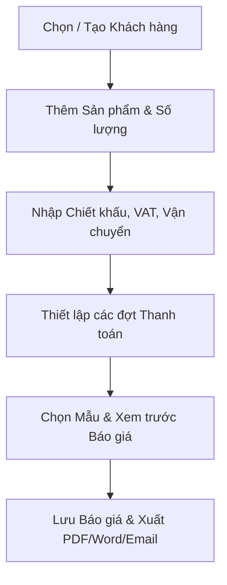
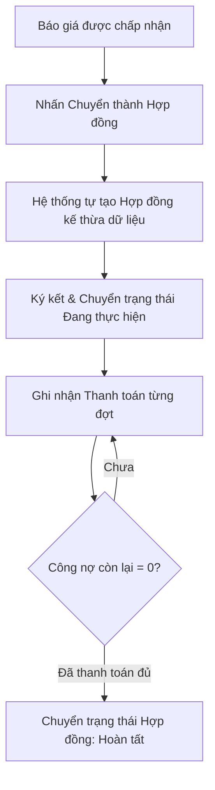

# TÀI LIỆU YÊU CẦU SẢN PHẨM (PRD)

# SellFlow — Hệ thống Quản lý Bán hàng, Báo giá, Hợp đồng & Công nợ

| Thông tin | Nội dung |
| --- | --- |
| Phiên bản | 1.0 — Bản đặc tả yêu cầu sản phẩm MVP |
| Trạng thái | Dự thảo, chờ xác nhận các quyết định nghiệp vụ |
| Ngày | 02/10/2026 |
| Mục đích | Định hướng thiết kế, phát triển và nghiệm thu hệ thống SellFlow |
| Nguồn | Tài liệu khảo sát quy trình bán hàng B2B và quản trị doanh nghiệp vừa & nhỏ |
| Người phê duyệt | **[CẦN XÁC NHẬN]** Product Owner và đại diện doanh nghiệp |

> **Quy ước:** **[CẦN XÁC NHẬN]** là thông tin chính sách/nghiệp vụ chưa được quyết định cứng. **[ĐỀ XUẤT]** là cách làm rõ để đội dự án xem xét; không mặc nhiên là phạm vi đã phê duyệt. Phạm vi Must/Should/Could tuân thủ phân loại MoSCoW.

---

## 1. Tóm tắt điều hành

**SellFlow** là hệ thống phần mềm tập trung giúp doanh nghiệp vừa và nhỏ (SMEs), hộ kinh doanh và các đơn vị thương mại dịch vụ số hóa quy trình bán hàng B2B. Hệ thống kết nối liền mạch chu trình từ **Quản lý danh mục sản phẩm & tồn kho -> Quản lý thông tin khách hàng -> Lập & gửi Báo giá -> Chuyển đổi ký kết Hợp đồng kinh tế -> Quản lý tiến độ thanh toán & Công nợ**.

Phạm vi MVP tập trung vào ba kết quả cốt lõi: **(1) Người dùng tạo báo giá và hợp đồng nhanh chóng, chính xác; (2) Theo dõi chặt chẽ tiến độ thu tiền và công nợ theo từng đợt; (3) Quản lý nắm bắt bức tranh doanh thu và tình trạng đơn hàng tập trung theo thời gian thực**.

Phạm vi MVP giả định vận hành cho **một pháp nhân/chi nhánh chính; phân quyền người dùng chi tiết (Role-Based Access Control) sẽ thuộc về giai đoạn sau**. Các tính năng nâng cao như ký số điện tử, kê khai thuế trực tiếp hay cổng thanh toán trực tuyến cũng là hướng mở rộng sau MVP.

---

## 2. Bối cảnh, bài toán và cơ hội

### 2.1. Hiện trạng

Trong thực tế vận hành tại nhiều doanh nghiệp vừa và nhỏ:
- Báo giá và hợp đồng được lập thủ công trên các file Excel, Word rời rạc, làm tăng nguy cơ sai sót đơn giá, tính sai thuế VAT và chiết khấu.
- Khi khách duyệt báo giá, nhân viên phải sao chép dữ liệu bằng tay sang file Word mẫu hợp đồng, gây mất thời gian và dễ phát sinh độ lệch thông tin giữa báo giá ban đầu và hợp đồng ký kết.
- Kế toán khó theo dõi tiến độ thanh toán nhiều đợt của các hợp đồng đang thực hiện, dẫn đến chậm trễ thu hồi công nợ hoặc bỏ sót đợt thanh toán đến hạn.
- Nhân viên bán hàng không nắm rõ số lượng hàng tồn kho thực tế khi lên đơn, dễ xảy ra tình trạng bán vượt tồn kho khả dụng.

Đây là mô tả bài toán định hướng sản phẩm. **Cần xác nhận các số liệu baseline cụ thể theo từng mô hình doanh nghiệp thí điểm** để đo lường hiệu quả sau triển khai.

### 2.2. Tuyên bố vấn đề

> Doanh nghiệp cần một hệ thống quản lý bán hàng tập trung, đảm bảo dữ liệu từ Báo giá được kế thừa trực tiếp sang Hợp đồng và Kế hoạch thanh toán, tự động hóa tính toán tài chính và tồn kho, đồng thời hỗ trợ xuất bản tài liệu in ấn/PDF/Word chuẩn mực cho khách hàng.

### 2.3. Giá trị dự kiến

- **Kinh doanh (Sales)**: Lập báo giá chuyên nghiệp chỉ trong vài phút, chuyển đổi hợp đồng với 1 thao tác, gửi trực tiếp tài liệu cho khách hàng.
- **Kế toán (Accountant)**: Kiểm soát tiến độ thu tiền theo từng đợt, ghi nhận thanh toán nhanh chóng, theo dõi chính xác công nợ còn lại của từng hợp đồng.
- **Kho hàng (Inventory)**: Cập nhật biến động xuất nhập tồn tức thì, nhận cảnh báo khi sản phẩm chạm ngưỡng tồn tối thiểu.
- **Quản lý (Owner/Manager)**: Theo dõi bức tranh tổng thể về doanh thu, tỷ lệ chuyển đổi đơn hàng và dòng tiền trên một màn hình Dashboard duy nhất.

---

## 3. Mục tiêu sản phẩm và thước đo

| Mã | Mục tiêu | Chỉ số và cách đo | Mức mục tiêu | Trạng thái |
| --- | --- | --- | --- | --- |
| **G-01** | Giảm thời gian tạo Báo giá | Từ khi chọn khách và sản phẩm đến khi hoàn tất bản báo giá | ≤ 2 phút | Mục tiêu cốt lõi |
| **G-02** | Rút ngắn thời gian lập Hợp đồng | Thời gian chuyển đổi dữ liệu từ Báo giá được duyệt sang Hợp đồng | ≤ 10 giây (1-click) | Điều kiện bắt buộc |
| **G-03** | Đảm bảo tính chính xác tài chính | Số lỗi sai lệch giữa tiền hàng, VAT, chiết khấu và tổng các đợt thanh toán | 0 sai sót | Điều kiện bắt buộc |
| **G-04** | Tăng hiệu quả thu hồi công nợ | Tỷ lệ các đợt thanh toán được ghi nhận đúng hạn và theo dõi đầy đủ | **[CẦN XÁC NHẬN]** baseline | Mục tiêu vận hành |
| **G-05** | Tốc độ phản hồi hệ thống | Thời gian phản hồi của các thao tác dữ liệu và xuất tài liệu | ≤ 2 giây | Tiêu chuẩn chất lượng |

---

## 4. Người dùng mục tiêu và nhu cầu

| Nhóm người dùng | Nhu cầu | Tác vụ chính |
| --- | --- | --- |
| **Nhân viên Kinh doanh (Sales)** | Soạn báo giá nhanh, gửi cho khách duyệt, chuyển đổi hợp đồng dễ dàng | Quản lý khách hàng, tạo báo giá, xuất PDF/Word, gửi email, chuyển đổi hợp đồng |
| **Kế toán / Thu ngân (Accountant)** | Theo dõi tiến độ thu tiền, quản lý công nợ từng hợp đồng, ghi nhận phiếu thanh toán | Xem hợp đồng, ghi nhận thanh toán theo đợt, đối soát công nợ |
| **Thủ kho (Inventory Staff)** | Quản lý số lượng tồn, thực hiện nhập/xuất kho, nhận cảnh báo hết hàng | Xem tồn kho, tạo phiếu nhập/xuất kho, điều chỉnh số lượng tồn |
| **Quản trị viên / Giám đốc (Admin)** | Kiểm soát toàn bộ số liệu kinh doanh, cấu hình doanh nghiệp và mẫu tài liệu | Xem Dashboard thống kê, cấu hình mẫu báo giá/hợp đồng, quản lý tài khoản & cài đặt |

---

## 5. Phạm vi sản phẩm

### 5.1. Phạm vi MVP bắt buộc (Must Have)

1. **Xác thực & Quản lý người dùng cơ bản**: Đăng nhập, đăng xuất, khôi phục mật khẩu qua mã OTP gửi về email (phân quyền phân vai trò chi tiết sẽ thực hiện ở giai đoạn sau).
2. **Quản lý Khách hàng**: Lưu trữ thông tin đối tác/khách hàng (Tên, Mã số thuế, Địa chỉ, Số điện thoại, Email, Người đại diện, Ghi chú); sinh mã định danh tự động.
3. **Quản lý Sản phẩm & Đơn vị tính**: Quản lý danh mục sản phẩm/dịch vụ; chọn Đơn vị tính từ danh mục chuẩn hóa; quản lý giá vốn, giá bán, số lượng tồn kho và mức tồn tối thiểu.
4. **Quản lý Tồn kho cơ bản**: Tạo phiếu Nhập kho và Xuất kho; lưu nhật ký biến động kho; cảnh báo khi tồn kho chạm mức tối thiểu.
5. **Soạn thảo & Quản lý Báo giá**:
   - Chọn khách hàng, thêm các dòng sản phẩm/dịch vụ, tự động tính thành tiền.
   - Hỗ trợ chiết khấu từng dòng, chiết khấu toàn đơn, thuế GTGT (VAT %) và phí vận chuyển.
   - Thiết lập điều khoản thanh toán theo đợt (Tỷ lệ %, số tiền, ngày dự kiến, ghi chú).
   - Xuất tài liệu định dạng PDF, Word và gửi email trực tiếp cho khách hàng.
   - Quản lý trạng thái vòng đời báo giá: *Nháp, Đã gửi, Chấp nhận, Từ chối, Hết hạn*.
6. **Quản lý Hợp đồng kinh tế**:
   - Tạo hợp đồng độc lập hoặc chuyển đổi trực tiếp 1-click từ Báo giá đã duyệt.
   - Kế thừa tự động toàn bộ danh mục sản phẩm, giá trị hợp đồng và tiến độ thanh toán.
   - Xuất bản hợp đồng kinh tế đầy đủ các điều khoản pháp lý chuẩn mực.
   - Quản lý trạng thái hợp đồng: *Nháp, Đang thực hiện, Hoàn tất, Đã hủy*.
7. **Quản lý Thanh toán & Công nợ**:
   - Ghi nhận thanh toán từng đợt gắn liền với hợp đồng (Tiền mặt / Chuyển khoản).
   - Tự động tính toán tổng số tiền đã thanh toán và số tiền công nợ còn phải thu.
8. **Quản lý Mẫu tài liệu**:
   - Trình biên tập mẫu trực quan với hệ thống biến thay thế dữ liệu tự động.
   - Hỗ trợ nhập mẫu Word (.docx), xem trước bản in, khóa mẫu và đặt làm mẫu mặc định.
9. **Cấu hình Doanh nghiệp & Quy tắc sinh mã**:
   - Cài đặt thông tin pháp nhân công ty, logo, thuế VAT mặc định, thời hạn hiệu lực báo giá.
   - Cấu hình tiền tố và quy tắc sinh mã tự động cho các loại chứng từ.
10. **Dashboard Tổng quan**: Thống kê doanh thu, số lượng báo giá/hợp đồng, tổng công nợ cần thu và biểu đồ doanh số theo thời gian.

### 5.2. Phạm vi ưu tiên tiếp theo (Should Have)

| Mức | Nhóm tính năng | Điều kiện xem xét |
| --- | --- | --- |
| **Should** | **Phân quyền người dùng chi tiết (RBAC)** | Phân tách quyền hạn chặt chẽ theo vai trò Admin, Sales, Kế toán (thuộc giai đoạn sau) |
| **Should** | Tự động trừ tồn kho khi kích hoạt hợp đồng | Cần chốt cơ chế trừ kho ngay lúc ký hay khi xuất kho thực tế |
| **Should** | Cảnh báo đợt thanh toán đến hạn / quá hạn tự động | Cần xác nhận kênh thông báo và tần suất nhắc |
| **Should** | Xuất báo cáo danh sách công nợ ra file Excel | Thực hiện khi có yêu cầu nghiệp vụ kế toán mở rộng |

### 5.3. Phạm vi xem xét giai đoạn sau (Could Have)

| Mức | Nhóm tính năng | Ghi chú |
| --- | --- | --- |
| **Could** | Ký số điện tử (E-Signature) trực tuyến | Tích hợp cổng ký số bên thứ 3 sau khi luồng MVP ổn định |
| **Could** | Tự động tạo mã VietQR động theo đợt thanh toán | Bổ sung khi có nhu cầu thanh toán ngân hàng tự động |
| **Could** | Phân hệ tính hoa hồng cho nhân viên kinh doanh | Đặc tả riêng theo chính sách thưởng của từng doanh nghiệp |
| **Could** | Trợ lý AI trong SellFlow | Tích hợp AI để hỗ trợ soạn thảo báo giá, hợp đồng, hoặc phân tích dữ liệu kinh doanh |

### 5.4. Ngoài phạm vi hệ thống (Out of Scope)

Kê khai hóa đơn điện tử trực tiếp lên cơ quan Thuế, phân hệ hoạch toán kế toán tổng hợp chuyên sâu, quản lý quy trình sản xuất (BOM/MRP), và quản lý giao vận logistics tích hợp nhà vận chuyển bên ngoài.

### 5.5. Giả định và ràng buộc

- Hệ thống phục vụ cho một pháp nhân doanh nghiệp với dữ liệu tập trung.
- Định dạng tiền tệ và thuế tuân theo quy định kế toán hiện hành (mặc định đơn vị VNĐ).
- Việc gửi email qua SMTP phụ thuộc vào hạ tầng mail server của doanh nghiệp; lỗi gửi mail bên ngoài không được chặn luồng tạo và lưu chứng từ trên hệ thống.

---

## 6. Luồng người dùng (User Flows)

### 6.1. Luồng Lập và Phát hành Báo giá

1. Nhân viên chọn Khách hàng có sẵn hoặc tạo nhanh Khách hàng mới.
2. Thêm các sản phẩm/dịch vụ từ danh mục, điều chỉnh số lượng và đơn giá thỏa thuận.
3. Thiết lập chiết khấu, tỷ lệ thuế VAT và chi phí vận chuyển (nếu có).
4. Thiết lập kế hoạch thanh toán theo các đợt (tỷ lệ % và ngày dự kiến).
5. Chọn mẫu báo giá, kiểm tra bản xem trước tài liệu.
6. Lưu báo giá, xuất file PDF/Word hoặc gửi email trực tiếp cho khách hàng.

### 6.2. Luồng Chuyển đổi Hợp đồng và Thu hồi Công nợ

1. Khi khách hàng đồng ý báo giá, nhân viên mở chi tiết Báo giá và thực hiện thao tác **Chuyển thành Hợp đồng**.
2. Hệ thống tự động tạo Hợp đồng mới, sao chép toàn bộ thông tin khách hàng, danh mục hàng hóa và tiến độ thanh toán đã thỏa thuận.
3. Các bên tiến hành ký kết hợp đồng; trạng thái hợp đồng chuyển sang **Đang thực hiện**.
4. Khi khách thanh toán từng đợt, kế toán vào hợp đồng và thực hiện **Ghi nhận thanh toán**.
5. Hệ thống cập nhật số tiền đã thu và tự động tính lại số công nợ còn lại.
6. Khi tất cả các đợt thanh toán hoàn tất (công nợ = 0), hợp đồng được đánh dấu **Hoàn tất**.

---

## 7. Yêu cầu chức năng chi tiết

| ID | Ưu tiên | Yêu cầu nghiệp vụ có thể kiểm thử |
| --- | --- | --- |
| **FR-01** | Must | Đăng nhập bằng Email và Mật khẩu; Quên mật khẩu gửi mã OTP ngẫu nhiên về email để xác thực đổi mật khẩu mới. |
| **FR-02** | Must | Quản lý danh bạ khách hàng: thêm, sửa, xóa, tìm kiếm, lọc; tự động sinh mã khách hàng theo cấu trúc cấu hình. |
| **FR-03** | Must | Quản lý danh mục sản phẩm/dịch vụ: chọn Đơn vị tính từ danh mục chuẩn hóa; quản lý giá vốn, giá bán, tồn kho, mức tồn tối thiểu. |
| **FR-04** | Must | Quản lý kho: lập phiếu Nhập kho / Xuất kho; cập nhật số lượng tồn tức thì; hiển thị cảnh báo khi tồn kho ≤ tồn tối thiểu. |
| **FR-05** | Must | Soạn báo giá: tính toán tự động thành tiền từng dòng, chiết khấu, thuế VAT, phí vận chuyển và tổng cộng thanh toán. |
| **FR-06** | Must | Thiết lập điều khoản thanh toán theo đợt trong Báo giá và Hợp đồng với tỷ lệ %, số tiền và ngày đến hạn. |
| **FR-07** | Must | Chuyển đổi Báo giá sang Hợp đồng với 1 thao tác, tự động sao chép toàn bộ dữ liệu và liên kết mã báo giá gốc. |
| **FR-08** | Must | Quản lý danh sách hợp đồng, theo dõi trạng thái hợp đồng và in ấn/xuất file PDF/Word hợp đồng chuẩn. |
| **FR-09** | Must | Ghi nhận phiếu thanh toán theo hợp đồng (tiền mặt / chuyển khoản); tự động tính tổng đã thu và công nợ còn lại. |
| **FR-10** | Must | Quản lý mẫu Báo giá & Hợp đồng: trình biên tập trực quan với hệ thống biến thay thế, nhập file Word mẫu, đặt mẫu mặc định. |
| **FR-11** | Must | Gửi email Báo giá và Hợp đồng qua cấu hình SMTP; lưu nhật ký gửi mail (`email_logs`). |
| **FR-12** | Must | Cài đặt thông tin pháp nhân doanh nghiệp, logo và quy tắc định dạng mã sinh tự động cho các loại tài liệu. |
| **FR-13** | Must | Dashboard thống kê doanh thu, tổng công nợ phải thu, số lượng đơn hàng và biểu đồ doanh số theo thời gian. |
| **FR-14** | Should | Đánh dấu áp dụng trừ tồn kho khi hợp đồng chuyển sang trạng thái có hiệu lực. |
| **FR-15** | Should | Cảnh báo trực quan các đợt thanh toán quá hạn trên màn hình quản lý thanh toán. |

### 7.1. Ma trận phân quyền người dùng [ĐỀ XUẤT CHO GIAI ĐOẠN SAU]

> **Ghi chú phạm vi:** Trong giai đoạn MVP hiện tại, hệ thống tập trung hoàn thiện luồng nghiệp vụ bán hàng cốt lõi và dùng chung quyền truy cập quản trị cho các tài khoản nội bộ. Bảng ma trận phân quyền chi tiết dưới đây là **định hướng nghiệp vụ cho giai đoạn tiếp theo (Should Have)** khi mở rộng quy mô tổ chức:

| Nhóm chức năng | ADMIN | SALES | ACCOUNTANT | Giai đoạn |
| --- | :---: | :---: | :---: | :---: |
| Xem Dashboard tổng quan | Toàn quyền | Chỉ xem số liệu cá nhân | Toàn quyền tài chính | Giai đoạn sau |
| Quản lý Khách hàng | Toàn quyền | Toàn quyền | Xem & Cập nhật | Giai đoạn sau |
| Quản lý Sản phẩm & Đơn vị tính | Toàn quyền | Chỉ xem | Chỉ xem | Giai đoạn sau |
| Lập phiếu Nhập / Xuất kho | Toàn quyền | Không có quyền | Xem lịch sử kho | Giai đoạn sau |
| Tạo & Quản lý Báo giá | Toàn quyền | Toàn quyền | Xem | Giai đoạn sau |
| Chuyển đổi Báo giá -> Hợp đồng | Toàn quyền | Toàn quyền | Xem | Giai đoạn sau |
| Quản lý Hợp đồng | Toàn quyền | Tạo & Theo dõi | Toàn quyền | Giai đoạn sau |
| Ghi nhận Thanh toán & Công nợ | Toàn quyền | Xem tiến độ | Toàn quyền thu tiền | Giai đoạn sau |
| Quản lý Mẫu tài liệu (Templates) | Toàn quyền | Chỉ sử dụng | Chỉ sử dụng | Giai đoạn sau |
| Cấu hình Hệ thống & Doanh nghiệp | Toàn quyền | Không có quyền | Không có quyền | Giai đoạn sau |

---

## 8. Quy tắc nghiệp vụ (Business Rules)

| Mã | Quy tắc nghiệp vụ |
| --- | --- |
| **BR-01** | **Tính toán dòng hàng**: `Thành tiền = max(0, Số lượng * Đơn giá - Chiết khấu dòng)`. |
| **BR-02** | **Tính tổng tiền tài liệu**: `Tổng tiền hàng = Tổng các dòng thành tiền`; `Sau chiết khấu = max(0, Tổng tiền hàng - Chiết khấu đơn)`; `Thuế VAT = round(Sau chiết khấu * VAT% / 100)`; `TỔNG CỘNG THANH TOÁN = Sau chiết khấu + Thuế VAT + Phí vận chuyển`. |
| **BR-03** | **Khớp dữ liệu thanh toán**: Tổng tỷ lệ phần trăm (%) các đợt thanh toán phải bằng 100% và tổng số tiền các đợt thanh toán phải bằng chính xác `TỔNG CỘNG THANH TOÁN`. |
| **BR-04** | **Sinh mã chứng từ tự động**: Mã tài liệu được sinh tự động theo mẫu cấu hình `{PREFIX}-{YEAR}-{SEQ}`, trong đó `SEQ` là số thứ tự tăng dần tự động và duy nhất trong hệ thống. |
| **BR-05** | **Bảo toàn dữ liệu lịch sử**: Khi Báo giá đã được chuyển đổi thành Hợp đồng, báo giá chuyển sang trạng thái *Chấp nhận* và không được phép xóa để đảm bảo tính toàn vẹn dữ liệu. |
| **BR-06** | **Tính toán công nợ**: `Công nợ còn lại = TỔNG CỘNG THANH TOÁN - Tổng tiền các phiếu thanh toán đã ghi nhận`. Hợp đồng chỉ được chuyển sang trạng thái *Hoàn tất* khi công nợ bằng 0. |
| **BR-07** | **Đơn vị tính chuẩn**: Đơn vị tính của sản phẩm bắt buộc phải được chọn từ danh mục chuẩn hóa của hệ thống, không cho phép nhập tay tự do để tránh sai lệch dữ liệu. |
| **BR-08** | **Định dạng tiền tệ**: Mọi số tiền hiển thị trên giao diện và tài liệu xuất bản phải tuân theo định dạng chuẩn hóa, phân cách hàng nghìn rõ ràng. |
| **BR-09** | **Xuất bản tài liệu**: Báo giá và Hợp đồng khi xuất PDF/Word phải tự động thay thế đầy đủ các thẻ biến động bằng dữ liệu thực tế và có bố cục trang in hoàn chỉnh. |

### 8.1. Vòng đời Báo giá & Hợp đồng

| Trạng thái ban đầu | Hành động / Sự kiện | Trạng thái tiếp theo | Điều kiện chuyển |
| --- | --- | --- | --- |
| **Nháp** (Báo giá) | Gửi cho khách hàng | **Đã gửi** | Người dùng gửi email hoặc cập nhật trạng thái |
| **Đã gửi** (Báo giá) | Khách đồng ý / Tạo Hợp đồng | **Chấp nhận** | Chuyển đổi thành công sang Hợp đồng |
| **Đã gửi** (Báo giá) | Khách từ chối / Hết hạn | **Từ chối / Hết hạn** | Khách phản hồi hoặc vượt quá ngày hiệu lực |
| **Nháp** (Hợp đồng) | Ký kết hợp đồng | **Đang thực hiện** | Hai bên hoàn tất ký kết |
| **Đang thực hiện** | Thanh toán đủ 100% | **Hoàn tất** | Công nợ còn lại bằng 0 |
| **Đang thực hiện** | Hai bên hủy thỏa thuận | **Đã hủy** | **[CẦN XÁC NHẬN]** quyền hạn phê duyệt hủy |

---

## 9. Cấu trúc dữ liệu và Tích hợp

### 9.1. Các thực thể dữ liệu cốt lõi

| Thực thể | Thuộc tính chính | Quan hệ / Vai trò |
| --- | --- | --- |
| **User** | ID, email, password, name, role | Quản lý tài khoản người dùng nội bộ |
| **Customer** | ID (Mã KH), name, phone, email, tax, address, representative, note | Một khách hàng có thể có nhiều báo giá và hợp đồng |
| **Product** | ID (Mã SP), name, category, unit, cost, price, stock, minStock, status | Lưu thông tin sản phẩm, đơn giá và tồn kho |
| **Quote** | ID (Mã BG), customerId, date, status, discount, vatPct, shipping, paymentTerms, notes, validUntil | Lưu thông tin báo giá và điều khoản thanh toán |
| **QuoteItem** | ID, quoteId, productId, productName, qty, price, discount | Danh mục chi tiết các sản phẩm trong báo giá |
| **Contract** | ID (Mã HĐ), quoteId, customerId, date, status, paymentTerms, notes, stockApplied | Lưu hợp đồng kinh tế và tiến độ thanh toán |
| **ContractItem** | ID, contractId, productId, productName, qty, price | Danh mục chi tiết các sản phẩm trong hợp đồng |
| **Payment** | ID (Mã TT), contractId, date, amount, method, note | Ghi nhận các lần thanh toán theo hợp đồng |
| **InventoryTransaction** | ID (Mã NK), productId, date, type (in/out/adjust), qty, ref, note | Nhật ký các lần nhập / xuất / điều chỉnh kho |
| **Template** | ID, type (quote/contract), name, isDefault, paper, locked, content | Lưu trữ mẫu tài liệu và cấu trúc HTML định dạng |
| **AppSetting** | ID, companyName, companyAddress, companyPhone, companyEmail, companyTax, logoUrl, idFormat, vatDefault, quoteValidDays | Cấu hình thông tin doanh nghiệp và quy tắc hệ thống |

### 9.2. Tích hợp bên ngoài

- **Hạ tầng gửi Email (SMTP)**: Kết nối dịch vụ gửi email để gửi báo giá, hợp đồng và mã OTP xác thực.
- **Cơ sở dữ liệu**: Cơ sở dữ liệu quan hệ PostgreSQL đảm bảo tính toàn vẹn dữ liệu giao dịch tài chính.
- **Thư viện xuất bản tài liệu**: Tích hợp các bộ thư viện chuyển đổi HTML sang PDF và Word (.docx).

---

## 10. Danh sách màn hình và Định hướng UX

| Khu vực | Màn hình | Nội dung và tác vụ chính |
| --- | --- | --- |
| **Tổng quan** | Dashboard | Các thẻ chỉ số tổng hợp, biểu đồ doanh thu, danh sách báo giá và hợp đồng mới |
| **Khách hàng** | Danh sách & Chi tiết Khách hàng | Bảng tra cứu khách hàng, form thêm/sửa, xem lịch sử báo giá/hợp đồng của khách |
| **Sản phẩm & Kho** | Quản lý Sản phẩm / Tồn kho | Danh mục sản phẩm, cảnh báo hết hàng, form lập phiếu nhập/xuất kho nhanh |
| **Báo giá** | Quản lý & Soạn thảo Báo giá | Bảng báo giá, form soạn thảo nhiều dòng sản phẩm, modal chia đợt thanh toán, xem trước & xuất tài liệu |
| **Hợp đồng** | Quản lý & Soạn thảo Hợp đồng | Bảng hợp đồng, form soạn thảo, theo dõi tiến độ thanh toán, in ấn và xuất file hợp đồng |
| **Thanh toán** | Quản lý Thanh toán & Công nợ | Bảng theo dõi các đợt thanh toán, form ghi nhận phiếu thu tiền theo từng hợp đồng |
| **Mẫu tài liệu** | Quản lý Mẫu Báo giá & Hợp đồng | Danh sách mẫu, trình soạn thảo trực quan, công cụ chèn biến thay thế dữ liệu |
| **Cài đặt** | Cài đặt Doanh nghiệp & Hệ thống | Cấu hình thông tin công ty, logo, quy tắc sinh mã, cấu hình email và tài khoản |
| **Xác thực** | Đăng nhập & Quên mật khẩu | Giao diện đăng nhập, form nhập email nhận OTP khôi phục mật khẩu |

---

## 11. Yêu cầu phi chức năng (NFR)

| Mã | Nhóm | Yêu cầu kỹ thuật |
| --- | --- | --- |
| **NFR-01** | **Hiệu năng** | Thời gian phản hồi của các thao tác dữ liệu ≤ 1.5 giây; thời gian kết xuất tài liệu PDF/Word ≤ 3 giây. |
| **NFR-02** | **Bảo mật** | Mật khẩu người dùng được băm an toàn; xác thực phiên làm việc bảo mật trước khi truy cập hệ thống. |
| **NFR-03** | **Toàn vẹn dữ liệu** | Sử dụng ràng buộc khóa ngoại trong CSDL; các phép tính toán tiền tệ và công nợ bảo đảm không bị sai lệch số học. |
| **NFR-04** | **Tính tương thích** | Giao diện hoạt động mượt mà trên các trình duyệt hiện đại (Chrome, Edge, Safari, Firefox) trên Desktop và Tablet. |
| **NFR-05** | **Khả năng kiểm toán (Audit)** | Lưu trữ nhật ký biến động kho và lịch sử gửi email để phục vụ đối soát và tra cứu khi cần thiết. |
| **NFR-06** | **Độ tin cậy** | Các lỗi kết nối mạng hoặc lỗi gửi mail bên ngoài không làm gián đoạn việc lưu trữ dữ liệu nghiệp vụ cốt lõi. |

---

## 12. Tiêu chí nghiệm thu (Acceptance Criteria)

### 12.1. Điều kiện bắt buộc của MVP

| Mã | Tình huống kiểm thử | Tiêu chí đạt |
| --- | --- | --- |
| **AC-01** | Tạo khách hàng và sản phẩm mới | Dữ liệu được lưu chính xác; mã khách hàng/sản phẩm tự động sinh đúng quy tắc cấu hình. |
| **AC-02** | Soạn Báo giá có thuế VAT và chiết khấu | Hệ thống tính toán đúng 100% thành tiền từng dòng, tiền thuế, tiền chiết khấu và tổng cộng thanh toán. |
| **AC-03** | Thiết lập điều khoản thanh toán theo đợt | Bảng các đợt thanh toán được lưu đầy đủ; tổng số tiền các đợt khớp chính xác với tổng tiền báo giá. |
| **AC-04** | Chuyển đổi Báo giá thành Hợp đồng | Hợp đồng mới được tạo ngay lập tức với đầy đủ sản phẩm, giá trị, khách hàng và điều khoản thanh toán kế thừa từ báo giá. |
| **AC-05** | Ghi nhận thanh toán và tính công nợ | Số tiền đã thanh toán tăng lên, công nợ còn lại giảm tương ứng; cập nhật đồng bộ lên Dashboard. |
| **AC-06** | Xuất bản file PDF và Word | Tài liệu xuất ra có đầy đủ thông tin doanh nghiệp, khách hàng, bảng sản phẩm và điều khoản thanh toán. |
| **AC-07** | Nhập kho và cảnh báo tồn kho | Số lượng tồn kho tăng đúng theo phiếu nhập; sản phẩm hiển thị cảnh báo khi số lượng tồn ≤ mức tồn tối thiểu. |
| **AC-08** | Khôi phục mật khẩu qua email OTP | Nhập đúng email đã đăng ký, hệ thống gửi mã OTP xác thực; nhập đúng OTP cho phép đổi mật khẩu mới thành công. |
| **AC-09** | Bảo mật xác thực người dùng | Người dùng chưa đăng nhập không thể truy cập các trang nghiệp vụ nội bộ; phân quyền vai trò chi tiết sẽ nghiệm thu ở giai đoạn sau. |

### 12.2. Definition of Done cho bản phát hành MVP

Hệ thống có đầy đủ dữ liệu mẫu (sản phẩm, khách hàng, mẫu báo giá và hợp đồng), vận hành trơn tru luồng nghiệp vụ từ tạo báo giá, chuyển đổi hợp đồng đến ghi nhận thanh toán và công nợ, không xảy ra lỗi nghiêm trọng (crash/blocker) và vượt qua 100% các tiêu chí nghiệm thu bắt buộc.

---

## 13. Rủi ro và Hướng xử lý

| Rủi ro tiềm ẩn | Mức độ | Hướng xử lý đề xuất |
| --- | :---: | --- |
| Lỗi dịch vụ gửi email bên ngoài làm gián đoạn luồng công việc | Trung bình | Lưu nhật ký lỗi vào `email_logs`; hiển thị thông báo trạng thái rõ ràng mà không làm gián đoạn thao tác lưu chứng từ. |
| Giá sản phẩm trong danh mục thay đổi làm ảnh hưởng báo giá cũ | Cao | Lưu ảnh chụp (snapshot) tên sản phẩm và đơn giá tại thời điểm tạo vào dòng chi tiết của báo giá/hợp đồng. |
| Người dùng nhập sai cấu trúc mã định danh chứng từ | Thấp | Khóa trường nhập mã thủ công, áp dụng cơ chế tự động sinh mã theo quy tắc định sẵn. |
| Xung đột dữ liệu khi nhiều người cùng thao tác trên một đơn hàng | Trung bình | **[ĐỀ XUẤT]** Áp dụng cơ chế kiểm tra phiên bản cập nhật khi lưu dữ liệu. |

---

## 14. Câu hỏi cần xác nhận và quyết định sản phẩm

| Mã | Mức ưu tiên | Quyết định nghiệp vụ cần chốt | Bên chịu trách nhiệm |
| --- | :---: | --- | --- |
| **Q-01** | **P0** | Trừ tồn kho tự động được thực hiện ngay khi Hợp đồng có hiệu lực hay khi lập Phiếu xuất kho thực tế? | Product Owner / Đại diện doanh nghiệp |
| **Q-02** | **P0** | Báo giá khi gửi cho khách có cần giới hạn số ngày hiệu lực bắt buộc để tự động chuyển sang trạng thái Hết hạn không? | Đại diện doanh nghiệp |
| **Q-03** | **P0** | Khi Hợp đồng đã có ghi nhận thanh toán một phần, có cho phép sửa lại danh mục hàng hóa hoặc giá trị hợp đồng không? | Đại diện doanh nghiệp / Kế toán |
| **Q-04** | **P1** | Cơ chế phân quyền chi tiết (RBAC) giữa Sales, Kế toán và Admin có triển khai ngay sau khi hoàn thành MVP không? | Product Owner / Đại diện doanh nghiệp |
| **Q-05** | **P1** | Có cần thiết lập hạn mức công nợ tối đa cho từng khách hàng để cảnh báo khi lên báo giá mới không? | Đại diện doanh nghiệp |
| **Q-06** | **P1** | Quy định về quyền hủy hợp đồng: người dùng có được tự hủy hợp đồng hay bắt buộc phải do Admin phê duyệt? | Product Owner / Đại diện doanh nghiệp |
| **Q-07** | **P2** | Thời gian lưu trữ dữ liệu lịch sử và quy định về việc sao lưu dữ liệu định kỳ của hệ thống? | Đội kỹ thuật |

---

## 15. Kịch bản trình diễn tham chiếu (Demo Flow)

1. **Chuẩn bị dữ liệu**: Hệ thống đã có danh mục sản phẩm thiết bị văn phòng, mức tồn kho và danh bạ khách hàng doanh nghiệp.
2. **Lập Báo giá**: Nhân viên kinh doanh tạo báo giá mới cho khách hàng, thêm 3 sản phẩm, áp dụng thuế VAT 10%, chia 3 đợt thanh toán (40% - 30% - 30%), xem trước bản in và xuất file PDF gửi khách.
3. **Chuyển đổi Hợp đồng**: Khi khách chốt đơn, nhân viên bấm nút **Chuyển thành Hợp đồng**. Hệ thống tự động sinh Hợp đồng kinh tế mới kế thừa đầy đủ dữ liệu.
4. **Ký kết & Ghi nhận Thanh toán**: Hợp đồng chuyển sang trạng thái thực hiện. Kế toán ghi nhận đợt thanh toán 1 (40% qua chuyển khoản ngân hàng). Hệ thống tự động trừ và hiển thị chính xác số tiền công nợ còn lại 60%.
5. **Theo dõi Dashboard**: Màn hình tổng quan cập nhật tức thì doanh thu mới ghi nhận và danh sách đơn hàng đang thực hiện.

---

**Tài liệu được sử dụng làm căn cứ phát triển và nghiệm thu cho dự án SellFlow.**
